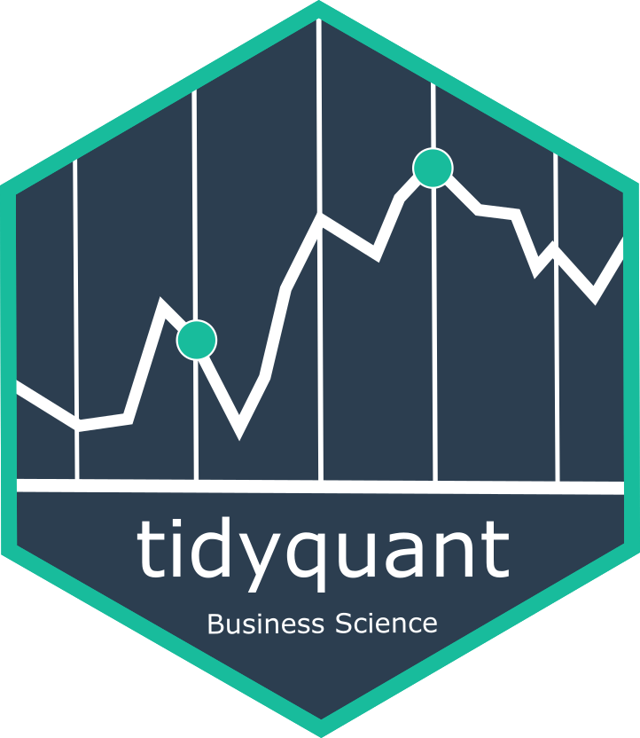
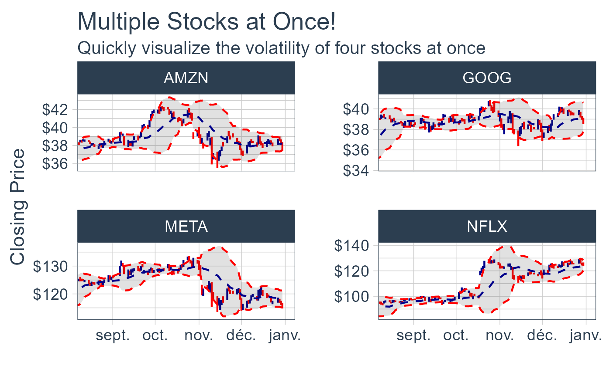
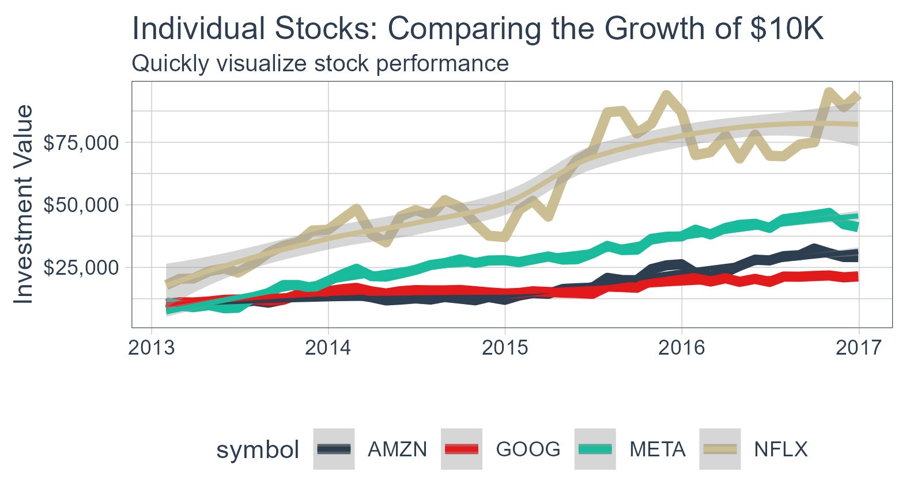
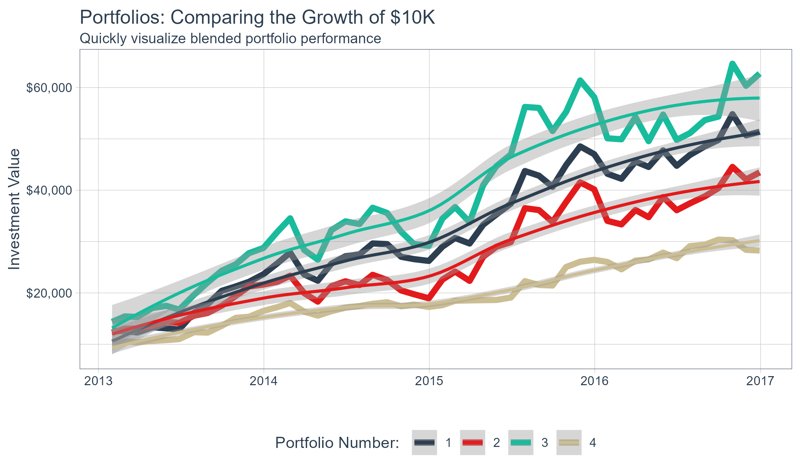

<!-- README.md is generated from README.Rmd. Please edit that file -->

# tidyquant 

<!-- badges: start -->

[](https://github.com/business-science/tidyquant/actions/workflows/R-CMD-check.yaml)
[](https://app.codecov.io/gh/business-science/tidyquant)
[](https://cran.r-project.org/package=tidyquant)


<!-- badges: end -->

> Bringing financial and business analysis to the tidyverse

## 2-Minutes To tidyquant

Our short introduction to `tidyquant` on
[YouTube](https://www.youtube.com/embed/woxJZTL2hok).

<a href="https://www.youtube.com/embed/woxJZTL2hok" target="_blank"></a>

# Features of tidyquant

`tidyquant` integrates the best resources for collecting and analyzing
financial data using `zoo`, `xts`, `quantmod`, `TTR`, and
`PerformanceAnalytics`, with the tidy data infrastructure of the
`tidyverse` allows for seamless interaction between each. You can now
perform complete financial analyses in the `tidyverse`.

- **A few core functions with a lot of power**
- **Integrates the quantitative analysis functionality of `zoo`, `xts`,
  `quantmod`, `TTR`, and *now* `PerformanceAnalytics`**
- **Designed for modeling and scaling analyses using the `tidyverse`
  tools in [*R for Data Science*](https://r4ds.hadley.nz/)**
- **Implements `ggplot2` functionality for beautiful and meaningful
  financial visualizations**
- **User-friendly documentation to get you up to speed quickly!**

### New Excel Functionality in tidyquant

- [**Excel in R - Pivot Tables, VLOOKUPs, and
  more**](https://www.business-science.io/finance/2020/02/26/r-for-excel-users.html):
  Details on the **Excel integrations** are covered in the blog article.

## One-Stop Shop for Serious Financial Analysis

With `tidyquant`, all the benefits add up to one thing: *a one-stop shop
for serious financial analysis!*

### Core Functions

- **Getting Financial Data from the web: `tq_get()`**. This is a
  one-stop shop for getting web-based financial data in a “tidy” data
  frame format. Get data for daily stock prices (historical), key
  statistics (real-time), key ratios (historical), financial statements,
  dividends, splits, economic data from the FRED, FOREX rates from
  Oanda.

- **Manipulating Financial Data: `tq_transmute()` and `tq_mutate()`**.
  Integration for many financial functions from `xts`, `zoo`,
  `quantmod`, `TTR` and `PerformanceAnalytics` packages. `tq_mutate()` is
  used to add a column to the data frame, and `tq_transmute()` is used
  to return a new data frame which is necessary for periodicity changes.

- **Performance Analysis and Portfolio Analysis: `tq_performance()` and
  `tq_portfolio()`**. The newest additions to the `tidyquant` family
  integrate `PerformanceAnalytics` functions. `tq_performance()`
  converts investment returns into performance metrics. `tq_portfolio()`
  aggregates a group (or multiple groups) of asset returns into one or
  more portfolios.

### Comparing Stock Prices

Visualizing the stock price volatility of four stocks side-by-side is
quick and easy…



### Evaluating Stock Performance

What about stock performance? Quickly visualize how a \$10,000
investment in various stocks would perform.



### Evaluating Portfolio Performance

Ok, stocks are too easy. What about portfolios? With the
`PerformanceAnalytics` integration, visualizing blended portfolios is
easy too!

- Portfolio 1: 50% FB, 25% AMZN, 25% NFLX, 0% GOOG
- Portfolio 2: 0% FB, 50% AMZN, 25% NFLX, 25% GOOG
- Portfolio 3: 25% FB, 0% AMZN, 50% NFLX, 25% GOOG
- Portfolio 4: 25% FB, 25% AMZN, 0% NFLX, 50% GOOG



This just scratches the surface of `tidyquant`. Here’s how to install to
get started.

## Installation

Development Version with Latest Features:

``` r
# install.packages("devtools")
devtools::install_github("business-science/tidyquant")
```

CRAN Approved Version:

``` r
install.packages("tidyquant")
```

## Further Information

The `tidyquant` package includes several vignettes to help users get up
to speed quickly:

- [TQ00 - Introduction to
  `tidyquant`](https://business-science.github.io/tidyquant/articles/TQ00-introduction-to-tidyquant.html)
- [TQ01 - Core Functions in
  `tidyquant`](https://business-science.github.io/tidyquant/articles/TQ01-core-functions-in-tidyquant.html)
- [TQ02 - R Quantitative Analysis Package Integrations in
  `tidyquant`](https://business-science.github.io/tidyquant/articles/TQ02-quant-integrations-in-tidyquant.html)
- [TQ03 - Scaling and Modeling with
  `tidyquant`](https://business-science.github.io/tidyquant/articles/TQ03-scaling-and-modeling-with-tidyquant.html)
- [TQ04 - Charting with
  `tidyquant`](https://business-science.github.io/tidyquant/articles/TQ04-charting-with-tidyquant.html)
- [TQ05 - Performance Analysis with
  `tidyquant`](https://business-science.github.io/tidyquant/articles/TQ05-performance-analysis-with-tidyquant.html)
- [Blog Article: Excel in R - PivotTables, VLOOKUPs, and
  more!](https://www.business-science.io/finance/2020/02/26/r-for-excel-users.html)

# Want to Learn tidyquant?

- [Learning Lab
  \#9:](https://university.business-science.io/p/learning-labs-pro)

  - **Performance Analysis & Portfolio Optimization with `tidyquant`** -
    A 1-hour course on `tidyquant` in Learning Labs PRO

- [Learning Lab
  \#10:](https://university.business-science.io/p/learning-labs-pro)

  - **Building an API with `plumber`** - Build a stock optimization API
    with `plumber` and `tidyquant`

- [Learning Lab
  \#16:](https://university.business-science.io/p/learning-labs-pro)

  - **Stock Portfolio Optimization and Nonlinear Programming** - Use the
    `ROI` package with `tidyquant` to calculate optimal minimum variance
    portfolios and develop an efficient frontier.

- [Learning Lab
  \#30:](https://university.business-science.io/courses/learning-labs-pro/lectures/14630075)

  - **Shiny Financial Analysis with Tidyquant API & Excel Pivot
    Tables** - Learn how to use the new Excel Functionality to make
    Pivot Tables, VLOOKUPs, SUMIFs, and more!
