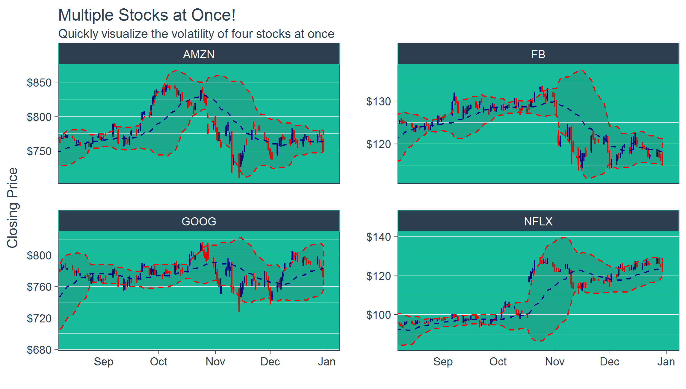
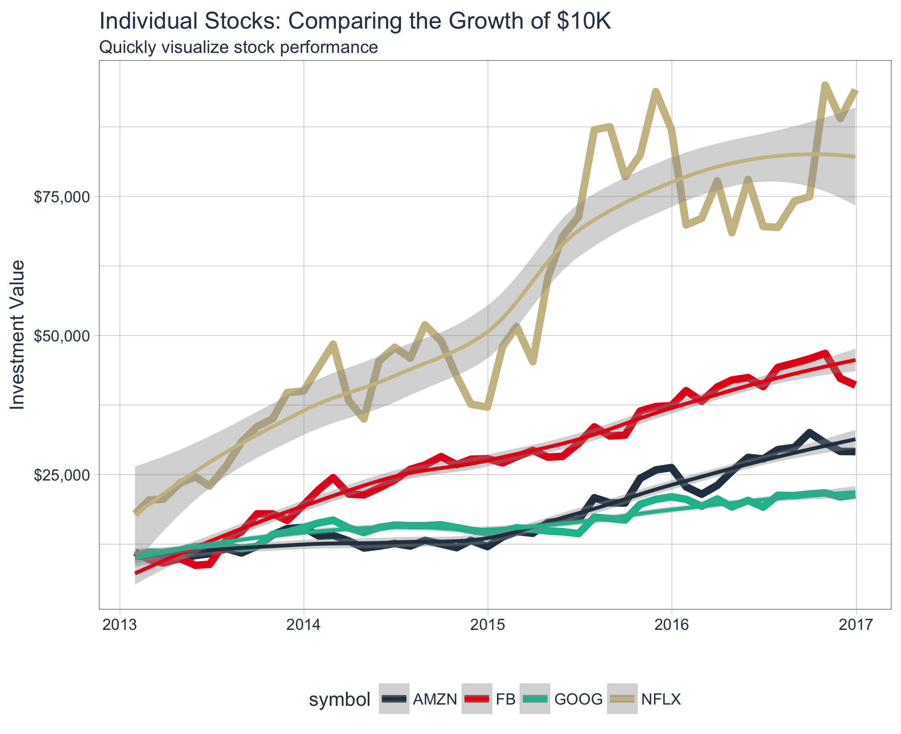
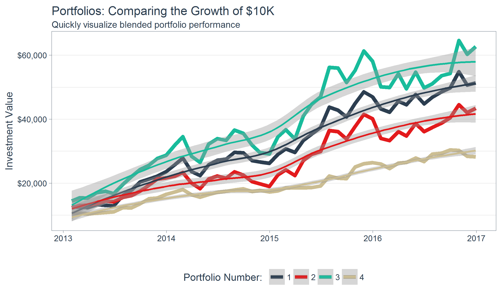

<!-- README.md is generated from README.Rmd. Please edit that file -->
tidyquant
=========

[](https://travis-ci.org/mdancho84/tidyquant) [](https://cran.r-project.org/package=tidyquant)  


> Bringing financial analysis to the tidyverse

`tidyquant` integrates the best resources for collecting and analyzing financial data, `zoo`, `xts`, `quantmod`, `TTR`, and `PerformanceAnalytics`, with the tidy data infrastructure of the `tidyverse` allowing for seamless interaction between each. You can now perform complete financial analyses in the `tidyverse`.

Benefits
--------

-   **A few core functions with a lot of power**
-   **Integrates the quantitative analysis functionality of `zoo`, `xts`, `quantmod`, `TTR`, and *now* `PerformanceAnalytics`**
-   **Designed for modeling and scaling analyses using the the `tidyverse` tools in [*R for Data Science*](http://r4ds.had.co.nz/)**
-   **Implements `ggplot2` functionality for beautiful and meaningful financial visualizations**
-   **User-friendly documentation to get you up to speed quickly!**

One-Stop Shop for Serious Financial Analysis
--------------------------------------------

With `tidyquant` all the benefits add up to one thing: *a one-stop shop for serious financial analysis!*

### Comparing Stock Prices

Visualizing the stock price volatility of four stocks side-by-side is quick and easy...



### Evaluating Stock Performance

What about stock performance? Quickly visualize how a $10,000 investment in various stocks would perform.



### Evaluating Portfolio Performance

Ok, stocks are too easy. What about portfolios? With the `PerformanceAnalytics` integration, visualizing blended portfolios are easy too!

-   Portfolio 1: 50% FB, 25% AMZN, 25% NFLX, 0% GOOG
-   Portfolio 2: 0% FB, 50% AMZN, 25% NFLX, 25% GOOG
-   Portfolio 3: 25% FB, 0% AMZN, 50% NFLX, 25% GOOG
-   Portfolio 4: 25% FB, 25% AMZN, 0% NFLX, 50% GOOG



This just scratches the surface of `tidyquant`. Here's how to install to get started.

Installation
------------

Development Version with Latest Features:

``` r
# install.packages("devtools")
devtools::install_github("mdancho84/tidyquant", build_vignettes = TRUE)
```

CRAN Approved Version:

``` r
install.packages("tidyquant")
```

Further Information
-------------------

The `tidyquant` package includes several vignettes to help users get up to speed quickly:

-   TQ00 - Introduction to `tidyquant`
-   TQ01 - Core Functions in `tidyquant`
-   TQ02 - R Quantitative Analysis Package Integrations in `tidyquant`
-   TQ03 - Scaling Your Analysis with `tidyquant`
-   TQ04 - Charting with `tidyquant`
-   TQ05 - Performance Analysis with `tidyquant`

See the [`tidyquant` vignettes](https://cran.r-project.org/package=tidyquant) for further details on the package.
