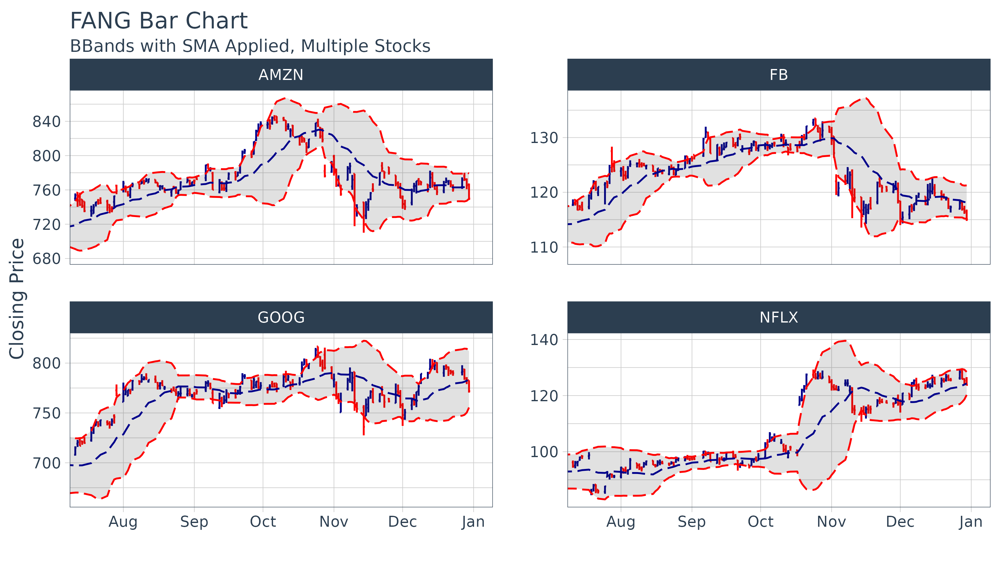

# Introduction to tidyquant

### 2-Minutes To Tidyquant

Our short introduction to `tidyquant` on
[YouTube](https://www.youtube.com/embed/woxJZTL2hok).

Check out our entire [Software Intro
Series](https://www.youtube.com/watch?v=Gk_HwjhlQJs&list=PLo32uKohmrXsYNhpdwr15W143rX6uMAze)
on YouTube!

## Benefits

- A few core functions with a lot of power
- Integrates the quantitative analysis functionality of `zoo`, `xts`,
  `quantmod`, `TTR`, and `PerformanceAnalytics`
- Designed for modeling and scaling analyses using the `tidyverse` tools
  in [*R for Data Science*](https://r4ds.hadley.nz/)
- Implements `ggplot2` functionality for beautiful and meaningful
  financial visualizations
- User-friendly documentation to get you up to speed quickly!

### A Few Core Functions with A Lot of Power

Minimizing the number of functions reduces the learning curve. What
we’ve done is group the core functions into four categories:

1.  **Get a Stock Index,
    [`tq_index()`](https://business-science.github.io/tidyquant/reference/tq_index.md),
    or a Stock Exchange,
    [`tq_exchange()`](https://business-science.github.io/tidyquant/reference/tq_index.md)**:
    Returns the stock symbols and various attributes for every stock in
    an index or exchange. Eighteen indexes and three exchanges are
    available.

2.  **Get Quantitative Data,
    [`tq_get()`](https://business-science.github.io/tidyquant/reference/tq_get.md)**:
    A one-stop shop to get data from various web-sources.

3.  **Transmute,
    [`tq_transmute()`](https://business-science.github.io/tidyquant/reference/tq_mutate.md),
    and Mutate,
    [`tq_mutate()`](https://business-science.github.io/tidyquant/reference/tq_mutate.md),
    Quantitative Data**: Perform and scale financial calculations
    completely within the `tidyverse`. These workhorse functions
    integrate the `xts`, `zoo`, `quantmod`, `TTR`, and
    `PerformanceAnalytics` packages.

4.  **Performance analysis,
    [`tq_performance()`](https://business-science.github.io/tidyquant/reference/tq_performance.md),
    and portfolio aggregation,
    [`tq_portfolio()`](https://business-science.github.io/tidyquant/reference/tq_portfolio.md)**:
    The `PerformanceAnalytics` integration enables analyzing performance
    of assets and portfolios. Refer to [Performance Analysis with
    tidyquant](https://business-science.github.io/tidyquant/articles/TQ05-performance-analysis-with-tidyquant.md).

For more information, refer to the first topic-specific vignette, [Core
Functions in
tidyquant](https://business-science.github.io/tidyquant/articles/TQ01-core-functions-in-tidyquant.md).

### Integrates the Quantitative Analysis Functionality of xts/zoo, quantmod TTR and Performance Analytics

There’s a wide range of useful quantitative analysis functions (QAF)
that work with time-series objects. The problem is that many of these
*wonderful* functions don’t work with data frames or the `tidyverse`
workflow. That is until now. The `tidyquant` package integrates the most
useful functions from the `xts`, `zoo`, `quantmod`, `TTR`, and
`PerformanceAnalytics` packages, enabling seamless usage within the
`tidyverse` workflow.

Refer below for information on the performance analysis and portfolio
attribution with the `PerformanceAnalytics` integration.

For more information, refer to the second topic-specific vignette, [R
Quantitative Analysis Package Integrations in
tidyquant](https://business-science.github.io/tidyquant/articles/TQ02-quant-integrations-in-tidyquant.md).

### Designed for the data science workflow of the tidyverse

The greatest benefit to `tidyquant` is the ability to easily model and
scale your financial analysis. Scaling is the process of creating an
analysis for one security and then extending it to multiple groups. This
idea of scaling is incredibly useful to financial analysts because
typically one wants to compare many securities to make informed
decisions. Fortunately, the `tidyquant` package integrates with the
`tidyverse` making scaling super simple!

All `tidyquant` functions return data in the `tibble` (tidy data frame)
format, which allows for interaction within the `tidyverse`. This means
we can:

- Seamlessly scale data retrieval and mutations
- Use the pipe (`%>%`) for chaining operations
- Use `dplyr` and `tidyr`: `select`, `filter`, `group_by`,
  `nest`/`unnest`, `spread`/`gather`, etc
- Use `purrr`: mapping functions with `map`

For more information, refer to the third topic-specific vignette,
[Scaling and Modeling with
tidyquant](https://business-science.github.io/tidyquant/articles/TQ03-scaling-and-modeling-with-tidyquant.md).

### Implements ggplot2 Functionality for Financial Visualizations

The `tidyquant` package includes charting tools to assist users in
developing quick visualizations in `ggplot2` using the grammar of
graphics format and workflow.

For more information, refer to the fourth topic-specific vignette,
[Charting with
tidyquant](https://business-science.github.io/tidyquant/articles/TQ04-charting-with-tidyquant.md).

### Performance Analysis of Asset and Portfolio Returns

Asset and portfolio performance analysis is a deep field with a wide
range of theories and methods for analyzing risk versus reward. The
`PerformanceAnalytics` package consolidates many of the most widely used
performance metrics as functions that can be applied to stock or
portfolio returns. `tidyquant` implements the functionality with two
primary functions:

- [`tq_performance()`](https://business-science.github.io/tidyquant/reference/tq_performance.md)
  implements the performance analysis functions in a tidy way, enabling
  scaling analysis using the split, apply, combine framework.
- [`tq_portfolio()`](https://business-science.github.io/tidyquant/reference/tq_portfolio.md)
  provides a useful toolset for aggregating a group of individual asset
  returns into one or many portfolios.

Performance is based on the statistical properties of returns, and as a
result both functions use **returns as opposed to stock prices**.

For more information, refer to the fifth topic-specific vignette,
[Performance Analysis with
tidyquant](https://business-science.github.io/tidyquant/articles/TQ05-performance-analysis-with-tidyquant.md).
