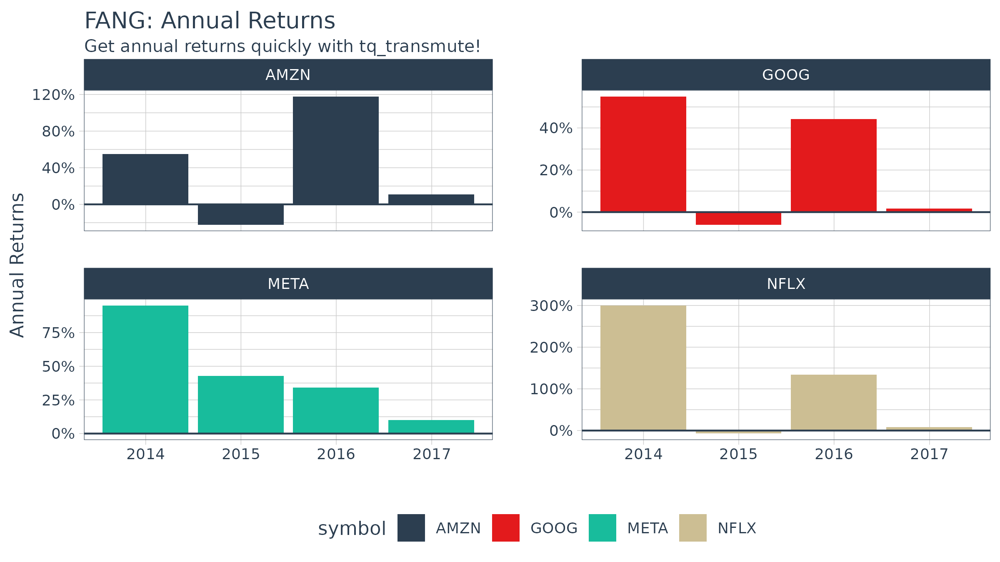
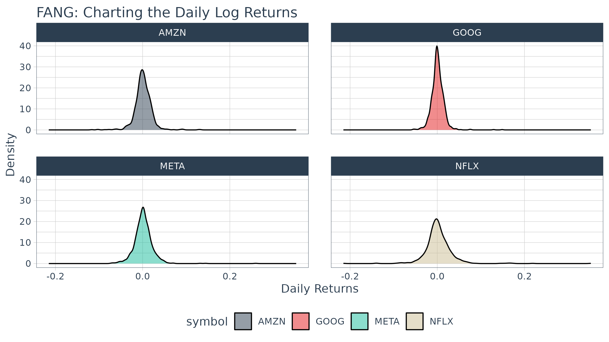
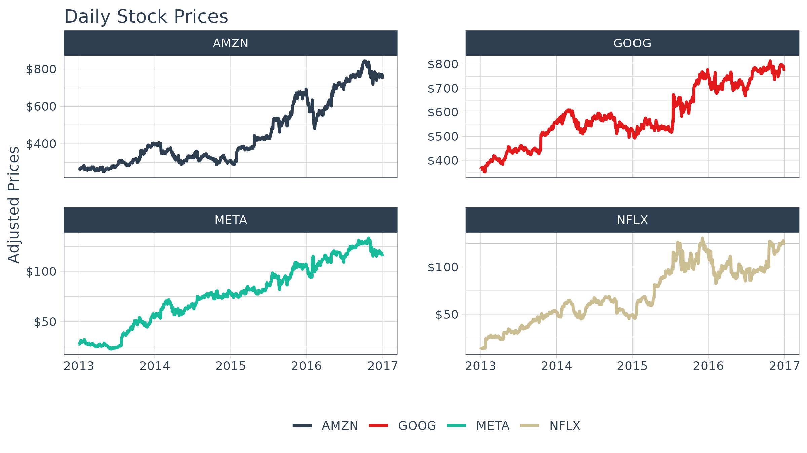
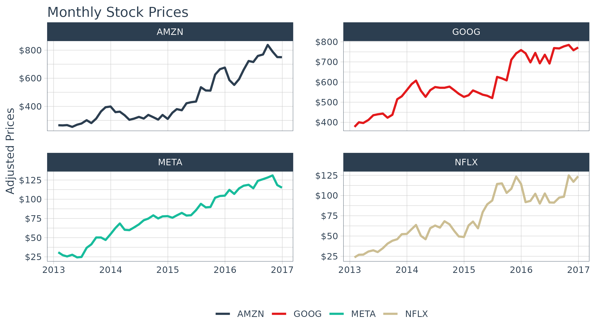
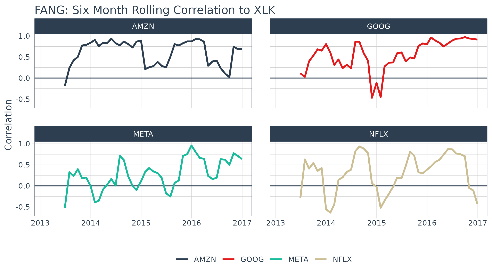
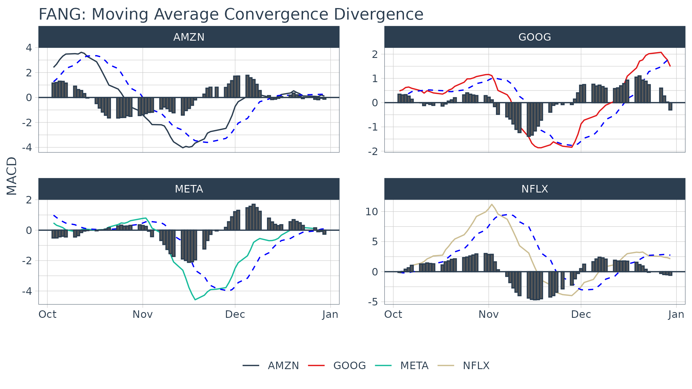
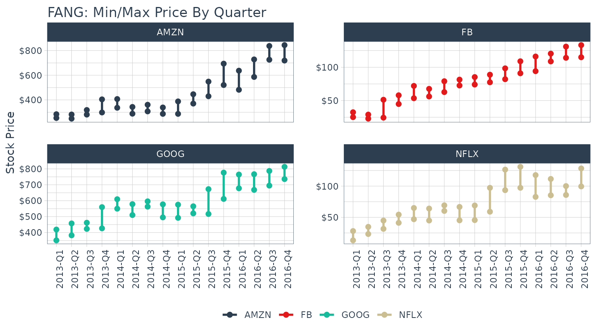
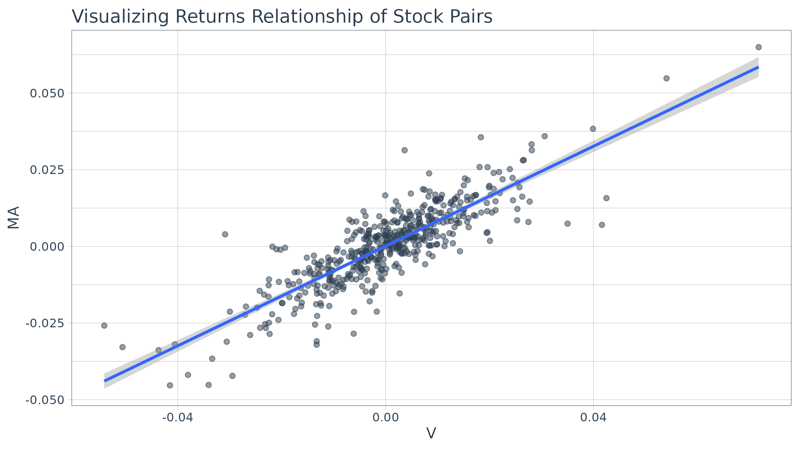
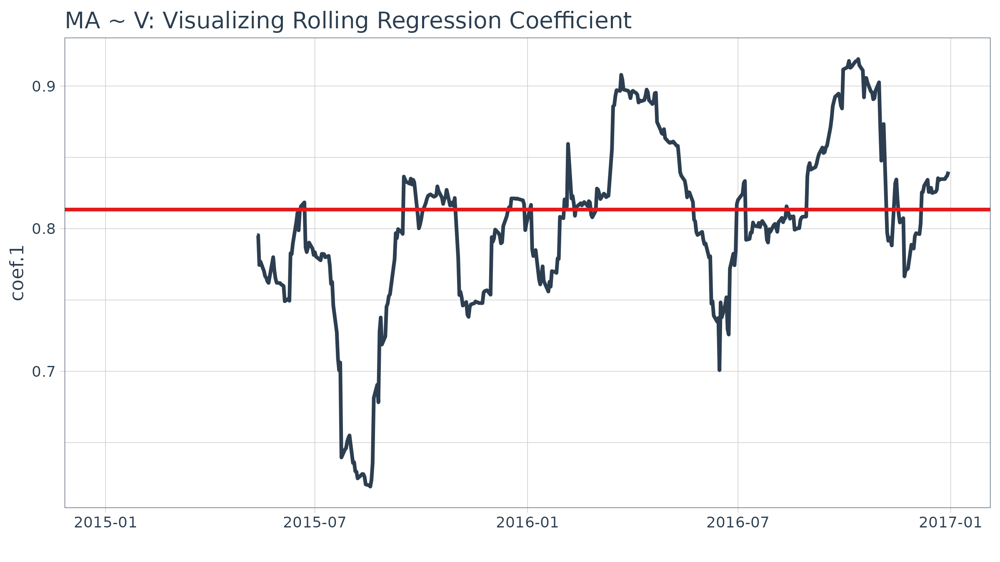
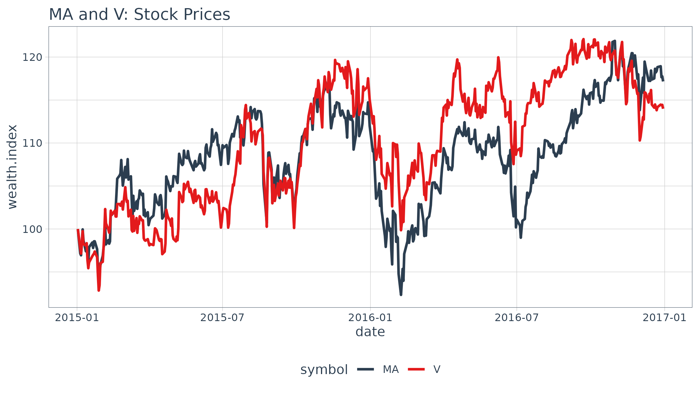

# R Quantitative Analysis Package Integrations in tidyquant

> Functions that leverage the quantitative analysis functionality of
> `xts`, `zoo`, `quantmod`, `TTR`, and `PerformanceAnalytics`

## Overview

There’s a wide range of useful quantitative analysis functions that work
with time-series objects. The problem is that many of these *wonderful*
functions don’t work with data frames or the `tidyverse` workflow. That
is until now! The `tidyquant` package integrates the most useful
functions from the `xts`, `zoo`, `quantmod`, `TTR`, and
`PerformanceAnalytics` packages. This vignette focuses on the following
*core functions* to demonstrate how the integration works with the
quantitative finance packages:

- Transmute,
  [`tq_transmute()`](https://business-science.github.io/tidyquant/reference/tq_mutate.md):
  Returns a new tidy data frame typically in a different periodicity
  than the input.
- Mutate,
  [`tq_mutate()`](https://business-science.github.io/tidyquant/reference/tq_mutate.md):
  Adds columns to the existing tidy data frame.

Refer to [Performance Analysis with
tidyquant](https://business-science.github.io/tidyquant/articles/TQ05-performance-analysis-with-tidyquant.md)
for a full discussion on performance analysis and portfolio attribution
with `tidyquant`.

## Prerequisites

Load the `tidyquant` package to get started.

``` r
# Loads tidyquant, xts, quantmod, TTR 
library(tidyquant)
library(tidyverse)
```

## 1.0 Function Compatibility

[`tq_transmute_fun_options()`](https://business-science.github.io/tidyquant/reference/tq_mutate.md)
returns a list the **compatible mutate functions** by each package.
We’ll discuss these options by package briefly.

``` r
tq_transmute_fun_options() %>% str()
```

    ## List of 5
    ##  $ zoo                 : chr [1:14] "rollapply" "rollapplyr" "rollmax" "rollmax.default" ...
    ##  $ xts                 : chr [1:27] "apply.daily" "apply.monthly" "apply.quarterly" "apply.weekly" ...
    ##  $ quantmod            : chr [1:25] "allReturns" "annualReturn" "ClCl" "dailyReturn" ...
    ##  $ TTR                 : chr [1:64] "adjRatios" "ADX" "ALMA" "aroon" ...
    ##  $ PerformanceAnalytics: chr [1:7] "Return.annualized" "Return.annualized.excess" "Return.clean" "Return.cumulative" ...

### zoo Functionality

``` r
# Get zoo functions that work with tq_transmute and tq_mutate
tq_transmute_fun_options()$zoo
```

    ##  [1] "rollapply"          "rollapplyr"         "rollmax"           
    ##  [4] "rollmax.default"    "rollmaxr"           "rollmean"          
    ##  [7] "rollmean.default"   "rollmeanr"          "rollmedian"        
    ## [10] "rollmedian.default" "rollmedianr"        "rollsum"           
    ## [13] "rollsum.default"    "rollsumr"

The `zoo` functions that are compatible are listed above. Generally
speaking, these are the:

- Roll Apply Functions:
  - A generic function for applying a function to rolling margins.
  - Form:
    `rollapply(data, width, FUN, ..., by = 1, by.column = TRUE, fill = if (na.pad) NA, na.pad = FALSE, partial = FALSE, align = c("center", "left", "right"), coredata = TRUE)`.
  - Options include `rollmax`, `rollmean`, `rollmedian`, `rollsum`, etc.

### xts Functionality

``` r
# Get xts functions that work with tq_transmute and tq_mutate
tq_transmute_fun_options()$xts
```

    ##  [1] "apply.daily"     "apply.monthly"   "apply.quarterly" "apply.weekly"   
    ##  [5] "apply.yearly"    "diff.xts"        "lag.xts"         "period.apply"   
    ##  [9] "period.max"      "period.min"      "period.prod"     "period.sum"     
    ## [13] "periodicity"     "to.daily"        "to.hourly"       "to.minutes"     
    ## [17] "to.minutes10"    "to.minutes15"    "to.minutes3"     "to.minutes30"   
    ## [21] "to.minutes5"     "to.monthly"      "to.period"       "to.quarterly"   
    ## [25] "to.weekly"       "to.yearly"       "to_period"

The `xts` functions that are compatible are listed above. Generally
speaking, these are the:

- Period Apply Functions:
  - Apply a function to a time segment (e.g. `max`, `min`, `mean`, etc).
  - Form: `apply.daily(x, FUN, ...)`.
  - Options include `apply.daily`, `weekly`, `monthly`, `quarterly`,
    `yearly`.
- To-Period Functions:
  - Convert a time series to time series of lower periodicity
    (e.g. convert daily to monthly periodicity).
  - Form:
    `to.period(x, period = 'months', k = 1, indexAt, name = NULL, OHLC = TRUE, ...)`.
  - Options include `to.minutes`, `hourly`, `daily`, `weekly`,
    `monthly`, `quarterly`, `yearly`.
  - **Note 1 (Important)**: The return structure is different for
    `to.period` and the `to.monthly` (`to.weekly`, `to.quarterly`, etc)
    forms. `to.period` returns a date, while `to.months` returns a
    character MON YYYY. Best to use `to.period` if you want to work with
    time-series via `lubridate`.

### quantmod Functionality

``` r
# Get quantmod functions that work with tq_transmute and tq_mutate
tq_transmute_fun_options()$quantmod
```

    ##  [1] "allReturns"      "annualReturn"    "ClCl"            "dailyReturn"    
    ##  [5] "Delt"            "HiCl"            "Lag"             "LoCl"           
    ##  [9] "LoHi"            "monthlyReturn"   "Next"            "OpCl"           
    ## [13] "OpHi"            "OpLo"            "OpOp"            "periodReturn"   
    ## [17] "quarterlyReturn" "seriesAccel"     "seriesDecel"     "seriesDecr"     
    ## [21] "seriesHi"        "seriesIncr"      "seriesLo"        "weeklyReturn"   
    ## [25] "yearlyReturn"

The `quantmod` functions that are compatible are listed above. Generally
speaking, these are the:

- Percentage Change (Delt) and Lag Functions
  - Delt: `Delt(x1, x2 = NULL, k = 0, type = c("arithmetic", "log"))`
    - Variations of Delt: ClCl, HiCl, LoCl, LoHi, OpCl, OpHi, OpLo, OpOp
    - Form: `OpCl(OHLC)`
  - Lag: `Lag(x, k = 1)` / Next: `Next(x, k = 1)` (Can also use
    [`dplyr::lag`](https://dplyr.tidyverse.org/reference/lead-lag.html)
    and
    [`dplyr::lead`](https://dplyr.tidyverse.org/reference/lead-lag.html))
- Period Return Functions:
  - Get the arithmetic or logarithmic returns for various periodicity,
    which include daily, weekly, monthly, quarterly, and yearly.
  - Form:
    `periodReturn(x, period = 'monthly', subset = NULL, type = 'arithmetic', leading = TRUE, ...)`
- Series Functions:
  - Return values that describe the series. Options include describing
    the increases/decreases, acceleration/deceleration, and hi/low.
  - Forms: `seriesHi(x)`, `seriesIncr(x, thresh = 0, diff. = 1L)`,
    `seriesAccel(x)`

### TTR Functionality

``` r
# Get TTR functions that work with tq_transmute and tq_mutate
tq_transmute_fun_options()$TTR
```

    ##  [1] "adjRatios"          "ADX"                "ALMA"              
    ##  [4] "aroon"              "ATR"                "BBands"            
    ##  [7] "CCI"                "chaikinAD"          "chaikinVolatility" 
    ## [10] "CLV"                "CMF"                "CMO"               
    ## [13] "CTI"                "DEMA"               "DonchianChannel"   
    ## [16] "DPO"                "DVI"                "EMA"               
    ## [19] "EMV"                "EVWMA"              "GMMA"              
    ## [22] "growth"             "HMA"                "keltnerChannels"   
    ## [25] "KST"                "lags"               "MACD"              
    ## [28] "MFI"                "momentum"           "OBV"               
    ## [31] "PBands"             "ROC"                "rollSFM"           
    ## [34] "RSI"                "runCor"             "runCov"            
    ## [37] "runMAD"             "runMax"             "runMean"           
    ## [40] "runMedian"          "runMin"             "runPercentRank"    
    ## [43] "runSD"              "runSum"             "runVar"            
    ## [46] "SAR"                "SMA"                "SMI"               
    ## [49] "SNR"                "stoch"              "TDI"               
    ## [52] "TRIX"               "ultimateOscillator" "VHF"               
    ## [55] "VMA"                "volatility"         "VWAP"              
    ## [58] "VWMA"               "wilderSum"          "williamsAD"        
    ## [61] "WMA"                "WPR"                "ZigZag"            
    ## [64] "ZLEMA"

Here’ a brief description of the most popular functions from `TTR`:

- Welles Wilder’s Directional Movement Index:
  - `ADX(HLC, n = 14, maType, ...)`
- Bollinger Bands:
  - `BBands(HLC, n = 20, maType, sd = 2, ...)`: Bollinger Bands
- Rate of Change / Momentum:
  - `ROC(x, n = 1, type = c("continuous", "discrete"), na.pad = TRUE)`:
    Rate of Change
  - `momentum(x, n = 1, na.pad = TRUE)`: Momentum
- Moving Averages (maType):
  - `SMA(x, n = 10, ...)`: Simple Moving Average
  - `EMA(x, n = 10, wilder = FALSE, ratio = NULL, ...)`: Exponential
    Moving Average
  - `DEMA(x, n = 10, v = 1, wilder = FALSE, ratio = NULL)`: Double
    Exponential Moving Average
  - `WMA(x, n = 10, wts = 1:n, ...)`: Weighted Moving Average
  - `EVWMA(price, volume, n = 10, ...)`: Elastic, Volume-Weighted Moving
    Average
  - `ZLEMA(x, n = 10, ratio = NULL, ...)`: Zero Lag Exponential Moving
    Average
  - `VWAP(price, volume, n = 10, ...)`: Volume-Weighted Moving Average
    Price
  - `VMA(x, w, ratio = 1, ...)`: Variable-Length Moving Average
  - `HMA(x, n = 20, ...)`: Hull Moving Average
  - `ALMA(x, n = 9, offset = 0.85, sigma = 6, ...)`: Arnaud Legoux
    Moving Average
- MACD Oscillator:
  - `MACD(x, nFast = 12, nSlow = 26, nSig = 9, maType, percent = TRUE, ...)`
- Relative Strength Index:
  - `RSI(price, n = 14, maType, ...)`
- runFun:
  - `runSum(x, n = 10, cumulative = FALSE)`: returns sums over a
    n-period moving window.
  - `runMin(x, n = 10, cumulative = FALSE)`: returns minimums over a
    n-period moving window.
  - `runMax(x, n = 10, cumulative = FALSE)`: returns maximums over a
    n-period moving window.
  - `runMean(x, n = 10, cumulative = FALSE)`: returns means over a
    n-period moving window.
  - `runMedian(x, n = 10, non.unique = "mean", cumulative = FALSE)`:
    returns medians over a n-period moving window.
  - `runCov(x, y, n = 10, use = "all.obs", sample = TRUE, cumulative = FALSE)`:
    returns covariances over a n-period moving window.
  - `runCor(x, y, n = 10, use = "all.obs", sample = TRUE, cumulative = FALSE)`:
    returns correlations over a n-period moving window.
  - `runVar(x, y = NULL, n = 10, sample = TRUE, cumulative = FALSE)`:
    returns variances over a n-period moving window.
  - `runSD(x, n = 10, sample = TRUE, cumulative = FALSE)`: returns
    standard deviations over a n-period moving window.
  - `runMAD(x, n = 10, center = NULL, stat = "median", constant = 1.4826, non.unique = "mean", cumulative = FALSE)`:
    returns median/mean absolute deviations over a n-period moving
    window.
  - `wilderSum(x, n = 10)`: returns a Welles Wilder style weighted sum
    over a n-period moving window.
- Stochastic Oscillator / Stochastic Momentum Index:
  - `stoch(HLC, nFastK = 14, nFastD = 3, nSlowD = 3, maType, bounded = TRUE, smooth = 1, ...)`:
    Stochastic Oscillator
  - `SMI(HLC, n = 13, nFast = 2, nSlow = 25, nSig = 9, maType, bounded = TRUE, ...)`:
    Stochastic Momentum Index

### PerformanceAnalytics Functionality

``` r
# Get PerformanceAnalytics functions that work with tq_transmute and tq_mutate
tq_transmute_fun_options()$PerformanceAnalytics
```

    ## [1] "Return.annualized"        "Return.annualized.excess"
    ## [3] "Return.clean"             "Return.cumulative"       
    ## [5] "Return.excess"            "Return.Geltner"          
    ## [7] "zerofill"

The `PerformanceAnalytics` mutation functions all deal with returns:

- `Return.annualized` and `Return.annualized.excess`: Takes period
  returns and consolidates into annualized returns
- `Return.clean`: Removes outliers from returns
- `Return.excess`: Removes the risk-free rate from the returns to yield
  returns in excess of the risk-free rate
- `zerofill`: Used to replace `NA` values with zeros.

## 2.0 Quantitative Power In Action

We’ll go through some examples, but first let’s get some data. The
`FANG` data set will be used which consists of stock prices for META,
AMZN, NFLX, and GOOG from the beginning of 2013 to the end of 2016.

``` r
FANG
```

    ## # A tibble: 4,032 × 8
    ##    symbol date        open  high   low close    volume adjusted
    ##    <chr>  <date>     <dbl> <dbl> <dbl> <dbl>     <dbl>    <dbl>
    ##  1 META   2013-01-02  27.4  28.2  27.4  28    69846400     28  
    ##  2 META   2013-01-03  27.9  28.5  27.6  27.8  63140600     27.8
    ##  3 META   2013-01-04  28.0  28.9  27.8  28.8  72715400     28.8
    ##  4 META   2013-01-07  28.7  29.8  28.6  29.4  83781800     29.4
    ##  5 META   2013-01-08  29.5  29.6  28.9  29.1  45871300     29.1
    ##  6 META   2013-01-09  29.7  30.6  29.5  30.6 104787700     30.6
    ##  7 META   2013-01-10  30.6  31.5  30.3  31.3  95316400     31.3
    ##  8 META   2013-01-11  31.3  32.0  31.1  31.7  89598000     31.7
    ##  9 META   2013-01-14  32.1  32.2  30.6  31.0  98892800     31.0
    ## 10 META   2013-01-15  30.6  31.7  29.9  30.1 173242600     30.1
    ## # ℹ 4,022 more rows

### Example 1: Use quantmod periodReturn to Convert Prices to Returns

The
[`quantmod::periodReturn()`](https://rdrr.io/pkg/quantmod/man/periodReturn.html)
function generates returns by periodicity. We’ll go through a couple
usage cases.

#### Example 1A: Getting and Charting Annual Returns

We want to use the adjusted closing prices column (adjusted for stock
splits, which can make it appear that a stock is performing poorly if a
split is included). We set `select = adjusted`. We research the
`periodReturn` function, and we found that it accepts
`type = "arithmetic"` and `period = "yearly"`, which returns the annual
returns.

``` r
FANG_annual_returns <- FANG %>%
    group_by(symbol) %>%
    tq_transmute(select     = adjusted, 
                 mutate_fun = periodReturn, 
                 period     = "yearly", 
                 type       = "arithmetic")
FANG_annual_returns
```

    ## # A tibble: 16 × 3
    ## # Groups:   symbol [4]
    ##    symbol date       yearly.returns
    ##    <chr>  <date>              <dbl>
    ##  1 META   2013-12-31         0.952 
    ##  2 META   2014-12-31         0.428 
    ##  3 META   2015-12-31         0.341 
    ##  4 META   2016-12-30         0.0993
    ##  5 AMZN   2013-12-31         0.550 
    ##  6 AMZN   2014-12-31        -0.222 
    ##  7 AMZN   2015-12-31         1.18  
    ##  8 AMZN   2016-12-30         0.109 
    ##  9 NFLX   2013-12-31         3.00  
    ## 10 NFLX   2014-12-31        -0.0721
    ## 11 NFLX   2015-12-31         1.34  
    ## 12 NFLX   2016-12-30         0.0824
    ## 13 GOOG   2013-12-31         0.550 
    ## 14 GOOG   2014-12-31        -0.0597
    ## 15 GOOG   2015-12-31         0.442 
    ## 16 GOOG   2016-12-30         0.0171

Charting annual returns is just a quick use of the `ggplot2` package.

``` r
FANG_annual_returns %>%
    ggplot(aes(x = date, y = yearly.returns, fill = symbol)) +
    geom_col() +
    geom_hline(yintercept = 0, color = palette_light()[[1]]) +
    scale_y_continuous(labels = scales::percent) +
    labs(title = "FANG: Annual Returns",
         subtitle = "Get annual returns quickly with tq_transmute!",
         y = "Annual Returns", x = "") + 
    facet_wrap(~ symbol, ncol = 2, scales = "free_y") +
    theme_tq() + 
    scale_fill_tq()
```



#### Example 1B: Getting Daily Log Returns

Daily log returns follow a similar approach. Normally I go with a
transmute function,
[`tq_transmute()`](https://business-science.github.io/tidyquant/reference/tq_mutate.md),
because the `periodReturn` function accepts different periodicity
options, and anything other than daily will blow up a mutation. But, in
our situation the period returns periodicity is the same as the stock
prices periodicity (both daily), so we can use either. We want to use
the adjusted closing prices column (adjusted for stock splits, which can
make it appear that a stock is performing poorly if a split is
included), so we set `select = adjusted`. We researched the
`periodReturn` function, and we found that it accepts `type = "log"` and
`period = "daily"`, which returns the daily log returns.

``` r
FANG_daily_log_returns <- FANG %>%
    group_by(symbol) %>%
    tq_transmute(select     = adjusted, 
                 mutate_fun = periodReturn, 
                 period     = "daily", 
                 type       = "log",
                 col_rename = "daily.returns")
```

``` r
FANG_daily_log_returns %>%
    ggplot(aes(x = daily.returns, fill = symbol)) +
    geom_density(alpha = 0.5) +
    labs(title = "FANG: Charting the Daily Log Returns",
         x = "Daily Returns", y = "Density") +
    theme_tq() +
    scale_fill_tq() + 
    facet_wrap(~ symbol, ncol = 2)
```



### Example 2: Use xts to.period to Change the Periodicity from Daily to Monthly

The [`xts::to.period`](https://rdrr.io/pkg/xts/man/to.period.html)
function is used for periodicity aggregation (converting from a lower
level periodicity to a higher level such as minutes to hours or months
to years). Because we are seeking a return structure that is on a
different time scale than the input (daily versus weekly), we need to
use a transmute function. We select
[`tq_transmute()`](https://business-science.github.io/tidyquant/reference/tq_mutate.md)
and pass the open, high, low, close and volume columns via
`select = open:volume`. Looking at the documentation for `to.period`, we
see that it accepts a `period` argument that we can set to `"months"`.
The result is the OHLCV data returned with the dates changed to one day
per month.

``` r
FANG %>%
    group_by(symbol) %>%
    tq_transmute(select     = open:volume, 
                 mutate_fun = to.period, 
                 period     = "months")
```

    ## # A tibble: 192 × 7
    ## # Groups:   symbol [4]
    ##    symbol date        open  high   low close    volume
    ##    <chr>  <date>     <dbl> <dbl> <dbl> <dbl>     <dbl>
    ##  1 META   2013-01-31  29.2  31.5  28.7  31.0 190744900
    ##  2 META   2013-02-28  26.8  27.3  26.3  27.2  83027800
    ##  3 META   2013-03-28  26.1  26.2  25.5  25.6  28585700
    ##  4 META   2013-04-30  27.1  27.8  27.0  27.8  36245700
    ##  5 META   2013-05-31  24.6  25.0  24.3  24.4  35925000
    ##  6 META   2013-06-28  24.7  25.0  24.4  24.9  96778900
    ##  7 META   2013-07-31  38.0  38.3  36.3  36.8 154828700
    ##  8 META   2013-08-30  42.0  42.3  41.1  41.3  67735100
    ##  9 META   2013-09-30  50.1  51.6  49.8  50.2 100095000
    ## 10 META   2013-10-31  47.2  52    46.5  50.2 248809000
    ## # ℹ 182 more rows

A common usage case is to reduce the number of points to smooth time
series plots. Let’s check out the difference between daily and monthly
plots.

#### Without Periodicity Aggregation

``` r
FANG_daily <- FANG %>%
    group_by(symbol)

FANG_daily %>%
    ggplot(aes(x = date, y = adjusted, color = symbol)) +
    geom_line(linewidth = 1) +
    labs(title = "Daily Stock Prices",
         x = "", y = "Adjusted Prices", color = "") +
    facet_wrap(~ symbol, ncol = 2, scales = "free_y") +
    scale_y_continuous(labels = scales::dollar) +
    theme_tq() + 
    scale_color_tq()
```



#### With Monthly Periodicity Aggregation

``` r
FANG_monthly <- FANG %>%
    group_by(symbol) %>%
    tq_transmute(select     = adjusted, 
                 mutate_fun = to.period, 
                 period     = "months")

FANG_monthly %>%
    ggplot(aes(x = date, y = adjusted, color = symbol)) +
    geom_line(linewidth = 1) +
    labs(title = "Monthly Stock Prices",
         x = "", y = "Adjusted Prices", color = "") +
    facet_wrap(~ symbol, ncol = 2, scales = "free_y") +
    scale_y_continuous(labels = scales::dollar) +
    theme_tq() + 
    scale_color_tq()
```



### Example 3: Use TTR runCor to Visualize Rolling Correlations of Returns

Return correlations are a common way to analyze how closely an asset or
portfolio mimics a baseline index or fund. We will need a set of returns
for both the stocks and baseline. The stock will be the `FANG` data set
and the baseline will be the Spdr XLK technology sector. We have the
prices for the “FANG” stocks, so we use `tq_get` to retrieve the “XLK”
prices. The returns can be calculated from the “adjusted” prices using
the process in Example 1.

``` r
# Asset Returns
FANG_returns_monthly <- FANG %>%
    dplyr::group_by(symbol) %>%
    tq_transmute(select     = adjusted, 
                 mutate_fun = periodReturn,
                 period     = "monthly")

# Baseline Returns
baseline_returns_monthly <- "XLK" %>%
    tq_get(get  = "stock.prices",
           from = "2013-01-01", 
           to   = "2016-12-31") %>%
    tq_transmute(select     = adjusted, 
                 mutate_fun = periodReturn,
                 period     = "monthly")
```

Next, join the asset returns with the baseline returns by date.

``` r
returns_joined <- left_join(FANG_returns_monthly, 
                            baseline_returns_monthly,
                            by = "date")
returns_joined
```

    ## # A tibble: 192 × 4
    ## # Groups:   symbol [4]
    ##    symbol date       monthly.returns.x monthly.returns.y
    ##    <chr>  <date>                 <dbl>             <dbl>
    ##  1 META   2013-01-31          0.106             -0.0138 
    ##  2 META   2013-02-28         -0.120              0.00782
    ##  3 META   2013-03-28         -0.0613             0.0258 
    ##  4 META   2013-04-30          0.0856             0.0175 
    ##  5 META   2013-05-31         -0.123              0.0279 
    ##  6 META   2013-06-28          0.0218            -0.0289 
    ##  7 META   2013-07-31          0.479              0.0373 
    ##  8 META   2013-08-30          0.122             -0.0104 
    ##  9 META   2013-09-30          0.217              0.0253 
    ## 10 META   2013-10-31         -0.000398           0.0502 
    ## # ℹ 182 more rows

The [`TTR::runCor`](https://rdrr.io/pkg/TTR/man/runFun.html) function
can be used to evaluate rolling correlations using the xy pattern.
Looking at the documentation (`?runCor`), we can see that the arguments
include `x` and `y` along with a few additional arguments including `n`
for the width of the rolling correlation. Because the scale is monthly,
we’ll go with `n = 6` for a 6-month rolling correlation. The
`col_rename` argument enables easy renaming of the output column(s).

``` r
FANG_rolling_corr <- returns_joined %>%
    tq_transmute_xy(x          = monthly.returns.x, 
                    y          = monthly.returns.y,
                    mutate_fun = runCor,
                    n          = 6,
                    col_rename = "rolling.corr.6")
```

And, we can plot the rolling correlations for the FANG stocks.

``` r
FANG_rolling_corr %>%
    ggplot(aes(x = date, y = rolling.corr.6, color = symbol)) +
    geom_hline(yintercept = 0, color = palette_light()[[1]]) +
    geom_line(linewidth = 1) +
    labs(title = "FANG: Six Month Rolling Correlation to XLK",
         x = "", y = "Correlation", color = "") +
    facet_wrap(~ symbol, ncol = 2) +
    theme_tq() + 
    scale_color_tq()
```



### Example 4: Use TTR MACD to Visualize Moving Average Convergence Divergence

In reviewing the available options in the `TTR` package, we see that
`MACD` will get us the Moving Average Convergence Divergence (MACD). In
researching the documentation, the return is in the same periodicity as
the input and the functions work with OHLC functions, so we can use
[`tq_mutate()`](https://business-science.github.io/tidyquant/reference/tq_mutate.md).
MACD requires a price, so we select `close`.

``` r
FANG_macd <- FANG %>%
    group_by(symbol) %>%
    tq_mutate(select     = close, 
              mutate_fun = MACD, 
              nFast      = 12, 
              nSlow      = 26, 
              nSig       = 9, 
              maType     = SMA) %>%
    mutate(diff = macd - signal) %>%
    select(-(open:volume))
FANG_macd
```

    ## # A tibble: 4,032 × 6
    ## # Groups:   symbol [4]
    ##    symbol date       adjusted  macd signal  diff
    ##    <chr>  <date>        <dbl> <dbl>  <dbl> <dbl>
    ##  1 META   2013-01-02     28      NA     NA    NA
    ##  2 META   2013-01-03     27.8    NA     NA    NA
    ##  3 META   2013-01-04     28.8    NA     NA    NA
    ##  4 META   2013-01-07     29.4    NA     NA    NA
    ##  5 META   2013-01-08     29.1    NA     NA    NA
    ##  6 META   2013-01-09     30.6    NA     NA    NA
    ##  7 META   2013-01-10     31.3    NA     NA    NA
    ##  8 META   2013-01-11     31.7    NA     NA    NA
    ##  9 META   2013-01-14     31.0    NA     NA    NA
    ## 10 META   2013-01-15     30.1    NA     NA    NA
    ## # ℹ 4,022 more rows

And, we can visualize the data like so.

``` r
FANG_macd %>%
    filter(date >= as_date("2016-10-01")) %>%
    ggplot(aes(x = date)) + 
    geom_hline(yintercept = 0, color = palette_light()[[1]]) +
    geom_line(aes(y = macd, col = symbol)) +
    geom_line(aes(y = signal), color = "blue", linetype = 2) +
    geom_bar(aes(y = diff), stat = "identity", color = palette_light()[[1]]) +
    facet_wrap(~ symbol, ncol = 2, scale = "free_y") +
    labs(title = "FANG: Moving Average Convergence Divergence",
         y = "MACD", x = "", color = "") +
    theme_tq() +
    scale_color_tq()
```



### Example 5: Use xts apply.quarterly to Get the Max and Min Price for Each Quarter

The
[`xts::apply.quarterly()`](https://rdrr.io/pkg/xts/man/apply.monthly.html)
function that is part of the period apply group can be used to apply
functions by quarterly time segments. Because we are seeking a return
structure that is on a different time scale than the input (quarterly
versus daily), we need to use a transmute function. We select
`tq_transmute` and pass the close price using `select`, and we send this
subset of the data to the `apply.quarterly` function via the
`mutate_fun` argument. Looking at the documentation for
`apply.quarterly`, we see that we can pass a function to the argument,
`FUN`. We want the maximum values, so we set `FUN = max`. The result is
the quarters returned as a date and the maximum closing price during the
quarter returned as a double.

``` r
FANG_max_by_qtr <- FANG %>%
    group_by(symbol) %>%
    tq_transmute(select     = adjusted, 
                 mutate_fun = apply.quarterly, 
                 FUN        = max, 
                 col_rename = "max.close") %>%
    mutate(year.qtr = paste0(year(date), "-Q", quarter(date))) %>%
    select(-date)
FANG_max_by_qtr
```

    ## # A tibble: 64 × 3
    ## # Groups:   symbol [4]
    ##    symbol max.close year.qtr
    ##    <chr>      <dbl> <chr>   
    ##  1 META        32.5 2013-Q1 
    ##  2 META        29.0 2013-Q2 
    ##  3 META        51.2 2013-Q3 
    ##  4 META        58.0 2013-Q4 
    ##  5 META        72.0 2014-Q1 
    ##  6 META        67.6 2014-Q2 
    ##  7 META        79.0 2014-Q3 
    ##  8 META        81.4 2014-Q4 
    ##  9 META        85.3 2015-Q1 
    ## 10 META        88.9 2015-Q2 
    ## # ℹ 54 more rows

The minimum each quarter can be retrieved in much the same way. The data
frames can be joined using `left_join` to get the max and min by
quarter.

``` r
FANG_min_by_qtr <- FANG %>%
    group_by(symbol) %>%
    tq_transmute(select     = adjusted, 
                 mutate_fun = apply.quarterly, 
                 FUN        = min, 
                 col_rename = "min.close") %>%
    mutate(year.qtr = paste0(year(date), "-Q", quarter(date))) %>%
    select(-date)

FANG_by_qtr <- left_join(FANG_max_by_qtr, FANG_min_by_qtr,
                         by = c("symbol"   = "symbol",
                                "year.qtr" = "year.qtr"))
FANG_by_qtr
```

    ## # A tibble: 64 × 4
    ## # Groups:   symbol [4]
    ##    symbol max.close year.qtr min.close
    ##    <chr>      <dbl> <chr>        <dbl>
    ##  1 META        32.5 2013-Q1       25.1
    ##  2 META        29.0 2013-Q2       22.9
    ##  3 META        51.2 2013-Q3       24.4
    ##  4 META        58.0 2013-Q4       44.8
    ##  5 META        72.0 2014-Q1       53.5
    ##  6 META        67.6 2014-Q2       56.1
    ##  7 META        79.0 2014-Q3       62.8
    ##  8 META        81.4 2014-Q4       72.6
    ##  9 META        85.3 2015-Q1       74.1
    ## 10 META        88.9 2015-Q2       77.5
    ## # ℹ 54 more rows

And, we can visualize the data like so.

``` r
FANG_by_qtr %>%
    ggplot(aes(x = year.qtr, color = symbol)) +
    geom_segment(aes(xend = year.qtr, y = min.close, yend = max.close),
                 linewidth = 1) +
    geom_point(aes(y = max.close), size = 2) +
    geom_point(aes(y = min.close), size = 2) +
    facet_wrap(~ symbol, ncol = 2, scale = "free_y") +
    labs(title = "FANG: Min/Max Price By Quarter",
         y = "Stock Price", color = "") +
    theme_tq() +
    scale_color_tq() +
    scale_y_continuous(labels = scales::dollar) +
    theme(axis.text.x = element_text(angle = 90, hjust = 1),
          axis.title.x = element_blank())
```



### Example 6: Use zoo rollapply to visualize a rolling regression

A good way to analyze relationships over time is using rolling
calculations that compare two assets. Pairs trading is a common
mechanism for similar assets. While we will not go into a pairs trade
analysis, we will analyze the relationship between two similar assets as
a precursor to a pairs trade. In this example we will analyze two
similar assets, MasterCard (MA) and Visa (V) to show the relationship
via regression.

Before we analyze a rolling regression, it’s helpful to view the overall
trend in returns. To do this, we use
[`tq_get()`](https://business-science.github.io/tidyquant/reference/tq_get.md)
to get stock prices for the assets and
[`tq_transmute()`](https://business-science.github.io/tidyquant/reference/tq_mutate.md)
to transform the daily prices to daily returns. We’ll collect the data
and visualize via a scatter plot.

``` r
# Get stock pairs
stock_prices <- c("MA", "V") %>%
    tq_get(get  = "stock.prices",
           from = "2015-01-01",
           to   = "2016-12-31") %>%
    group_by(symbol) 

stock_pairs <- stock_prices %>%
    tq_transmute(select     = adjusted,
                 mutate_fun = periodReturn,
                 period     = "daily",
                 type       = "log",
                 col_rename = "returns") %>%
    spread(key = symbol, value = returns)
```

We can visualize the relationship between the returns of the stock pairs
like so.

``` r
stock_pairs %>%
    ggplot(aes(x = V, y = MA)) +
    geom_point(color = palette_light()[[1]], alpha = 0.5) +
    geom_smooth(method = "lm") +
    labs(title = "Visualizing Returns Relationship of Stock Pairs") +
    theme_tq()
```



We can get statistics on the relationship from the `lm` function. The
model is highly correlated with a p-value of essential zero. The
coefficient estimate for V (Coefficient 1) is 0.8134 indicating a
positive relationship, meaning as V increases MA also tends to increase.

``` r
lm(MA ~ V, data = stock_pairs) %>%
    summary()
```

    ## 
    ## Call:
    ## lm(formula = MA ~ V, data = stock_pairs)
    ## 
    ## Residuals:
    ##        Min         1Q     Median         3Q        Max 
    ## -0.0269575 -0.0039655  0.0002147  0.0039648  0.0289463 
    ## 
    ## Coefficients:
    ##              Estimate Std. Error t value Pr(>|t|)    
    ## (Intercept) 0.0001130  0.0003097   0.365    0.715    
    ## V           0.8133640  0.0226394  35.927   <2e-16 ***
    ## ---
    ## Signif. codes:  0 '***' 0.001 '**' 0.01 '*' 0.05 '.' 0.1 ' ' 1
    ## 
    ## Residual standard error: 0.00695 on 502 degrees of freedom
    ## Multiple R-squared:   0.72,  Adjusted R-squared:  0.7194 
    ## F-statistic:  1291 on 1 and 502 DF,  p-value: < 2.2e-16

While this characterizes the overall relationship, it’s missing the time
aspect. Fortunately, we can use the
[`zoo::rollapply()`](https://rdrr.io/pkg/zoo/man/rollapply.html)
function to plot a rolling regression, showing how the model coefficient
varies on a rolling basis over time. We calculate rolling regressions
with
[`tq_mutate()`](https://business-science.github.io/tidyquant/reference/tq_mutate.md)
in two additional steps:

1.  Create a custom function
2.  Apply the function with `tq_mutate(mutate_fun = rollapply)`

First, create a custom regression function. An important point is that
the “data” will be passed to the regression function as an `xts` object.
The
[`timetk::tk_tbl`](https://business-science.github.io/timetk/reference/tk_tbl.html)
function takes care of converting to a data frame.

``` r
regr_fun <- function(data) {
    coef(lm(MA ~ V, data = timetk::tk_tbl(data, silent = TRUE)))
}
```

Now we can use
[`tq_mutate()`](https://business-science.github.io/tidyquant/reference/tq_mutate.md)
to apply the custom regression function over a rolling window using
`rollapply` from the `zoo` package. Internally, the `returns_combined`
data frame is being passed automatically to the `data` argument of the
`rollapply` function. All you need to specify is the
`mutate_fun = rollapply` and any additional arguments necessary to apply
the `rollapply` function. We’ll specify a 90 day window via
`width = 90`. The `FUN` argument is our custom regression function,
`regr_fun`. It’s extremely important to specify `by.column = FALSE`,
which tells `rollapply` to perform the computation using the data as a
whole rather than apply the function to each column independently. The
`col_rename` argument is used to rename the added columns.

``` r
stock_pairs <- stock_pairs %>%
         tq_mutate(mutate_fun = rollapply,
                   width      = 90,
                   FUN        = regr_fun,
                   by.column  = FALSE,
                   col_rename = c("coef.0", "coef.1"))
stock_pairs
```

    ## # A tibble: 504 × 5
    ##    date             MA        V coef.0 coef.1
    ##    <date>        <dbl>    <dbl>  <dbl>  <dbl>
    ##  1 2015-01-02  0        0           NA     NA
    ##  2 2015-01-05 -0.0285  -0.0223      NA     NA
    ##  3 2015-01-06 -0.00216 -0.00646     NA     NA
    ##  4 2015-01-07  0.0154   0.0133      NA     NA
    ##  5 2015-01-08  0.0154   0.0133      NA     NA
    ##  6 2015-01-09 -0.0128  -0.0149      NA     NA
    ##  7 2015-01-12 -0.0129  -0.00196     NA     NA
    ##  8 2015-01-13  0.00228  0.00292     NA     NA
    ##  9 2015-01-14 -0.00108 -0.0202      NA     NA
    ## 10 2015-01-15 -0.0146  -0.00955     NA     NA
    ## # ℹ 494 more rows

Finally, we can visualize the first coefficient like so. A horizontal
line is added using the full data set model. This gives us insight as to
points in time where the relationship deviates significantly from the
long run trend which can be explored for potential pair trade
opportunities.

``` r
stock_pairs %>%
    ggplot(aes(x = date, y = coef.1)) +
    geom_line(linewidth = 1, color = palette_light()[[1]]) +
    geom_hline(yintercept = 0.8134, linewidth = 1, color = palette_light()[[2]]) +
    labs(title = "MA ~ V: Visualizing Rolling Regression Coefficient", x = "") +
    theme_tq()
```



Stock returns during this time period.

``` r
stock_prices %>%
    tq_transmute(adjusted, 
                 periodReturn, 
                 period = "daily", 
                 type = "log", 
                 col_rename = "returns") %>%
    mutate(wealth.index = 100 * cumprod(1 + returns)) %>%
    ggplot(aes(x = date, y = wealth.index, color = symbol)) +
    geom_line(linewidth = 1) +
    labs(title = "MA and V: Stock Prices") +
    theme_tq() + 
    scale_color_tq()
```



### Example 7: Use Return.clean and Return.excess to clean and calculate excess returns

In this example we use several of the `PerformanceAnalytics` functions
to clean and format returns. The example uses three progressive
applications of `tq_transmute` to apply various quant functions to the
grouped stock prices from the `FANG` data set. First, we calculate daily
returns using
[`quantmod::periodReturn`](https://rdrr.io/pkg/quantmod/man/periodReturn.html).
Next, we use `Return.clean` to clean outliers from the return data. The
`alpha` parameter is the percentage of outliers to be cleaned. Finally,
the excess returns are calculated using a risk-free rate of 3% (divided
by 252 for 252 trade days in one year).

``` r
FANG %>%
    group_by(symbol) %>%
    tq_transmute(adjusted, periodReturn, period = "daily") %>%
    tq_transmute(daily.returns, Return.clean, alpha = 0.05) %>%
    tq_transmute(daily.returns, Return.excess, Rf = 0.03 / 252)
```

    ## # A tibble: 4,032 × 3
    ## # Groups:   symbol [4]
    ##    symbol date       `daily.returns > Rf`
    ##    <chr>  <date>                    <dbl>
    ##  1 META   2013-01-02            -0.000119
    ##  2 META   2013-01-03            -0.00833 
    ##  3 META   2013-01-04             0.0355  
    ##  4 META   2013-01-07             0.0228  
    ##  5 META   2013-01-08            -0.0124  
    ##  6 META   2013-01-09             0.0525  
    ##  7 META   2013-01-10             0.0231  
    ##  8 META   2013-01-11             0.0133  
    ##  9 META   2013-01-14            -0.0244  
    ## 10 META   2013-01-15            -0.0276  
    ## # ℹ 4,022 more rows
