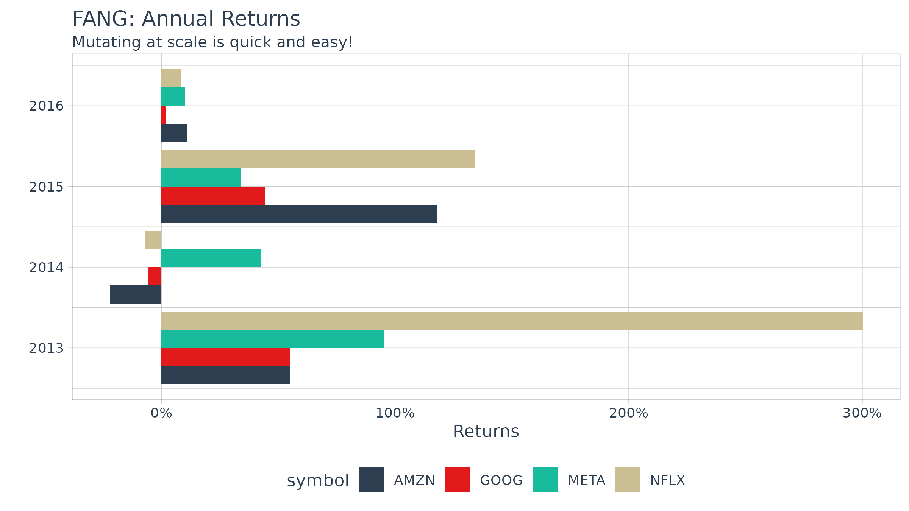
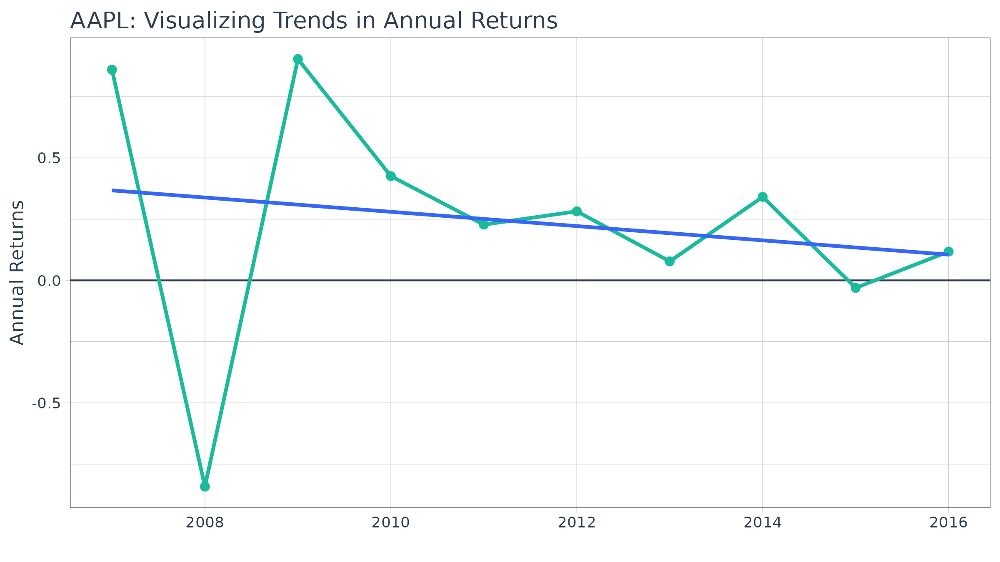

# Scaling and Modeling with tidyquant

> Designed for the data science workflow of the `tidyverse`

## Overview

The greatest benefit to `tidyquant` is the ability to apply the data
science workflow to easily model and scale your financial analysis as
described in [*R for Data Science*](https://r4ds.hadley.nz/). Scaling is
the process of creating an analysis for one asset and then extending it
to multiple groups. This idea of scaling is incredibly useful to
financial analysts because typically one wants to compare many assets to
make informed decisions. Fortunately, the `tidyquant` package integrates
with the `tidyverse` making scaling super simple!

All `tidyquant` functions return data in the `tibble` (tidy data frame)
format, which allows for interaction within the `tidyverse`. This means
we can:

- Seamlessly scale data retrieval and mutations
- Use the pipe (`%>%`) for chaining operations
- Use `dplyr` and `tidyr`: `select`, `filter`, `group_by`,
  `nest`/`unnest`, `spread`/`gather`, etc
- Use `purrr`: mapping functions with `map()`
- Model financial analysis using the data science workflow in [*R for
  Data Science*](https://r4ds.hadley.nz/)

We’ll go through some useful techniques for getting and manipulating
groups of data.

## Prerequisites

Load the `tidyquant` package to get started.

``` r
# Loads tidyquant, xts, quantmod, TTR, and PerformanceAnalytics
library(tidyverse)
library(tidyquant)  
```

## 1.0 Scaling the Getting of Financial Data

A very basic example is retrieving the stock prices for multiple stocks.
There are three primary ways to do this:

### Method 1: Map a character vector with multiple stock symbols

``` r
c("AAPL", "GOOG", "META") %>%
    tq_get(get = "stock.prices", from = "2016-01-01", to = "2017-01-01")
```

    ## # A tibble: 756 × 8
    ##    symbol date        open  high   low close    volume adjusted
    ##    <chr>  <date>     <dbl> <dbl> <dbl> <dbl>     <dbl>    <dbl>
    ##  1 AAPL   2016-01-04  25.7  26.3  25.5  26.3 270597600     23.7
    ##  2 AAPL   2016-01-05  26.4  26.5  25.6  25.7 223164000     23.1
    ##  3 AAPL   2016-01-06  25.1  25.6  25.0  25.2 273829600     22.7
    ##  4 AAPL   2016-01-07  24.7  25.0  24.1  24.1 324377600     21.7
    ##  5 AAPL   2016-01-08  24.6  24.8  24.2  24.2 283192000     21.8
    ##  6 AAPL   2016-01-11  24.7  24.8  24.3  24.6 198957600     22.2
    ##  7 AAPL   2016-01-12  25.1  25.2  24.7  25.0 196616800     22.5
    ##  8 AAPL   2016-01-13  25.1  25.3  24.3  24.3 249758400     21.9
    ##  9 AAPL   2016-01-14  24.5  25.1  23.9  24.9 252680400     22.4
    ## 10 AAPL   2016-01-15  24.0  24.4  23.8  24.3 319335600     21.9
    ## # ℹ 746 more rows

The output is a single level tibble with all or the stock prices in one
tibble. The auto-generated column name is “symbol”, which can be
preemptively renamed by giving the vector a name
(e.g. `stocks <- c("AAPL", "GOOG", "META")`) and then piping to
`tq_get`.

### Method 2: Map a tibble with stocks in first column

First, get a stock list in data frame format either by making the tibble
or retrieving from `tq_index` / `tq_exchange`. The stock symbols must be
in the first column.

#### Method 2A: Make a tibble

``` r
stock_list <- tibble(stocks = c("AAPL", "JPM", "CVX"),
                     industry = c("Technology", "Financial", "Energy"))
stock_list
```

    ## # A tibble: 3 × 2
    ##   stocks industry  
    ##   <chr>  <chr>     
    ## 1 AAPL   Technology
    ## 2 JPM    Financial 
    ## 3 CVX    Energy

Second, send the stock list to `tq_get`. Notice how the symbol and
industry columns are automatically expanded the length of the stock
prices.

``` r
stock_list %>%
    tq_get(get = "stock.prices", from = "2016-01-01", to = "2017-01-01")
```

    ## # A tibble: 756 × 9
    ##    stocks industry   date        open  high   low close    volume adjusted
    ##    <chr>  <chr>      <date>     <dbl> <dbl> <dbl> <dbl>     <dbl>    <dbl>
    ##  1 AAPL   Technology 2016-01-04  25.7  26.3  25.5  26.3 270597600     23.7
    ##  2 AAPL   Technology 2016-01-05  26.4  26.5  25.6  25.7 223164000     23.1
    ##  3 AAPL   Technology 2016-01-06  25.1  25.6  25.0  25.2 273829600     22.7
    ##  4 AAPL   Technology 2016-01-07  24.7  25.0  24.1  24.1 324377600     21.7
    ##  5 AAPL   Technology 2016-01-08  24.6  24.8  24.2  24.2 283192000     21.8
    ##  6 AAPL   Technology 2016-01-11  24.7  24.8  24.3  24.6 198957600     22.2
    ##  7 AAPL   Technology 2016-01-12  25.1  25.2  24.7  25.0 196616800     22.5
    ##  8 AAPL   Technology 2016-01-13  25.1  25.3  24.3  24.3 249758400     21.9
    ##  9 AAPL   Technology 2016-01-14  24.5  25.1  23.9  24.9 252680400     22.4
    ## 10 AAPL   Technology 2016-01-15  24.0  24.4  23.8  24.3 319335600     21.9
    ## # ℹ 746 more rows

#### Method 2B: Use index or exchange

Get an index…

``` r
tq_index("DOW")
```

    ## # A tibble: 31 × 8
    ##    symbol company      identifier sedol weight sector shares_held local_currency
    ##    <chr>  <chr>        <chr>      <chr>  <dbl> <chr>        <dbl> <chr>         
    ##  1 GS     GOLDMAN SAC… 38141G104  2407… 0.103  -          5636894 USD           
    ##  2 CAT    CATERPILLAR… 149123101  2180… 0.0917 -          5636894 USD           
    ##  3 MSFT   MICROSOFT C… 594918104  2588… 0.0523 -          5636894 USD           
    ##  4 AMGN   AMGEN INC    031162100  2023… 0.0484 -          5636894 USD           
    ##  5 HD     HOME DEPOT … 437076102  2434… 0.0448 -          5636894 USD           
    ##  6 MCD    MCDONALD S … 580135101  2550… 0.0431 -          5636894 USD           
    ##  7 SHW    SHERWIN WIL… 824348106  2804… 0.0422 -          5636894 USD           
    ##  8 V      VISA INC CL… 92826C839  B2PZ… 0.0406 -          5636894 USD           
    ##  9 TRV    TRAVELERS C… 89417E109  2769… 0.0400 -          5636894 USD           
    ## 10 AXP    AMERICAN EX… 025816109  2026… 0.0396 -          5636894 USD           
    ## # ℹ 21 more rows

…or, get an exchange.

``` r
tq_exchange("NYSE")
```

Send the index or exchange to `tq_get`. *Important Note: This can take
several minutes depending on the size of the index or exchange, which is
why only the first three stocks are evaluated in the vignette.*

``` r
tq_index("DOW") %>%
    slice(1:3) %>%
    tq_get(get = "stock.prices")
```

    ## # A tibble: 7,689 × 15
    ##    symbol company      identifier sedol weight sector shares_held local_currency
    ##    <chr>  <chr>        <chr>      <chr>  <dbl> <chr>        <dbl> <chr>         
    ##  1 GS     GOLDMAN SAC… 38141G104  2407…  0.103 -          5636894 USD           
    ##  2 GS     GOLDMAN SAC… 38141G104  2407…  0.103 -          5636894 USD           
    ##  3 GS     GOLDMAN SAC… 38141G104  2407…  0.103 -          5636894 USD           
    ##  4 GS     GOLDMAN SAC… 38141G104  2407…  0.103 -          5636894 USD           
    ##  5 GS     GOLDMAN SAC… 38141G104  2407…  0.103 -          5636894 USD           
    ##  6 GS     GOLDMAN SAC… 38141G104  2407…  0.103 -          5636894 USD           
    ##  7 GS     GOLDMAN SAC… 38141G104  2407…  0.103 -          5636894 USD           
    ##  8 GS     GOLDMAN SAC… 38141G104  2407…  0.103 -          5636894 USD           
    ##  9 GS     GOLDMAN SAC… 38141G104  2407…  0.103 -          5636894 USD           
    ## 10 GS     GOLDMAN SAC… 38141G104  2407…  0.103 -          5636894 USD           
    ## # ℹ 7,679 more rows
    ## # ℹ 7 more variables: date <date>, open <dbl>, high <dbl>, low <dbl>,
    ## #   close <dbl>, volume <dbl>, adjusted <dbl>

You can use any applicable “getter” to get data for **every stock in an
index or an exchange**! This includes: “stock.prices”, “key.ratios”,
“key.stats”, and more.

## 2.0 Scaling the Mutation of Financial Data

Once you get the data, you typically want to do something with it. You
can easily do this at scale. Let’s get the yearly returns for multiple
stocks using `tq_transmute`. First, get the prices. We’ll use the `FANG`
data set, but you typically will use `tq_get` to retrieve data in
“tibble” format.

``` r
FANG
```

    ## # A tibble: 4,032 × 8
    ##    symbol date        open  high   low close    volume adjusted
    ##    <chr>  <date>     <dbl> <dbl> <dbl> <dbl>     <dbl>    <dbl>
    ##  1 META   2013-01-02  27.4  28.2  27.4  28    69846400     28  
    ##  2 META   2013-01-03  27.9  28.5  27.6  27.8  63140600     27.8
    ##  3 META   2013-01-04  28.0  28.9  27.8  28.8  72715400     28.8
    ##  4 META   2013-01-07  28.7  29.8  28.6  29.4  83781800     29.4
    ##  5 META   2013-01-08  29.5  29.6  28.9  29.1  45871300     29.1
    ##  6 META   2013-01-09  29.7  30.6  29.5  30.6 104787700     30.6
    ##  7 META   2013-01-10  30.6  31.5  30.3  31.3  95316400     31.3
    ##  8 META   2013-01-11  31.3  32.0  31.1  31.7  89598000     31.7
    ##  9 META   2013-01-14  32.1  32.2  30.6  31.0  98892800     31.0
    ## 10 META   2013-01-15  30.6  31.7  29.9  30.1 173242600     30.1
    ## # ℹ 4,022 more rows

Second, use `group_by` to group by stock symbol. Third, apply the
mutation. We can do this in one easy workflow. The `periodReturn`
function is applied to each group of stock prices, and a new data frame
was returned with the annual returns in the correct periodicity.

``` r
FANG_returns_yearly <- FANG %>%
    group_by(symbol) %>%
    tq_transmute(select     = adjusted, 
                 mutate_fun = periodReturn, 
                 period     = "yearly", 
                 col_rename = "yearly.returns") 
```

Last, we can visualize the returns.

``` r
FANG_returns_yearly %>%
    ggplot(aes(x = year(date), y = yearly.returns, fill = symbol)) +
    geom_bar(position = "dodge", stat = "identity") +
    labs(title = "FANG: Annual Returns", 
         subtitle = "Mutating at scale is quick and easy!",
         y = "Returns", x = "", color = "") +
    scale_y_continuous(labels = scales::percent) +
    coord_flip() +
    theme_tq() +
    scale_fill_tq()
```



## 3.0 Modeling Financial Data using purrr

Eventually you will want to begin modeling (or more generally applying
functions) at scale! One of the **best** features of the `tidyverse` is
the ability to map functions to nested tibbles using `purrr`. From the
Many Models chapter of “[R for Data Science](https://r4ds.hadley.nz/)”,
we can apply the same modeling workflow to financial analysis. Using a
two step workflow:

1.  Model a single stock
2.  Scale to many stocks

Let’s go through an example to illustrate.

### Example: Applying a Regression Model to Detect a Positive Trend

In this example, we’ll use a simple linear model to identify the trend
in annual returns to determine if the stock returns are decreasing or
increasing over time.

#### Analyze a Single Stock

First, let’s collect stock data with
[`tq_get()`](https://business-science.github.io/tidyquant/reference/tq_get.md)

``` r
AAPL <- tq_get("AAPL", from = "2007-01-01", to = "2016-12-31")
AAPL
```

    ## # A tibble: 2,518 × 8
    ##    symbol date        open  high   low close     volume adjusted
    ##    <chr>  <date>     <dbl> <dbl> <dbl> <dbl>      <dbl>    <dbl>
    ##  1 AAPL   2007-01-03  3.08  3.09  2.92  2.99 1238319600     2.51
    ##  2 AAPL   2007-01-04  3.00  3.07  2.99  3.06  847260400     2.57
    ##  3 AAPL   2007-01-05  3.06  3.08  3.01  3.04  834741600     2.55
    ##  4 AAPL   2007-01-08  3.07  3.09  3.05  3.05  797106800     2.56
    ##  5 AAPL   2007-01-09  3.09  3.32  3.04  3.31 3349298400     2.77
    ##  6 AAPL   2007-01-10  3.38  3.49  3.34  3.46 2952880000     2.91
    ##  7 AAPL   2007-01-11  3.43  3.46  3.40  3.42 1440252800     2.87
    ##  8 AAPL   2007-01-12  3.38  3.39  3.33  3.38 1312690400     2.84
    ##  9 AAPL   2007-01-16  3.42  3.47  3.41  3.47 1244076400     2.91
    ## 10 AAPL   2007-01-17  3.48  3.49  3.39  3.39 1646260000     2.84
    ## # ℹ 2,508 more rows

Next, come up with a function to help us collect annual log returns. The
function below mutates the stock prices to period returns using
[`tq_transmute()`](https://business-science.github.io/tidyquant/reference/tq_mutate.md).
We add the `type = "log"` and `period = "monthly"` arguments to ensure
we retrieve a tibble of monthly log returns. Last, we take the mean of
the monthly returns to get MMLR.

``` r
get_annual_returns <- function(stock.returns) {
    stock.returns %>%
        tq_transmute(select     = adjusted, 
                     mutate_fun = periodReturn, 
                     type       = "log", 
                     period     = "yearly")
}
```

Let’s test `get_annual_returns` out. We now have the annual log returns
over the past ten years.

``` r
AAPL_annual_log_returns <- get_annual_returns(AAPL)
AAPL_annual_log_returns
```

    ## # A tibble: 10 × 2
    ##    date       yearly.returns
    ##    <date>              <dbl>
    ##  1 2007-12-31         0.860 
    ##  2 2008-12-31        -0.842 
    ##  3 2009-12-31         0.904 
    ##  4 2010-12-31         0.426 
    ##  5 2011-12-30         0.228 
    ##  6 2012-12-31         0.282 
    ##  7 2013-12-31         0.0776
    ##  8 2014-12-31         0.341 
    ##  9 2015-12-31        -0.0306
    ## 10 2016-12-30         0.118

Let’s visualize to identify trends. We can see from the linear trend
line that AAPL’s stock returns are declining.

``` r
AAPL_annual_log_returns %>%
    ggplot(aes(x = year(date), y = yearly.returns)) + 
    geom_hline(yintercept = 0, color = palette_light()[[1]]) +
    geom_point(size = 2, color = palette_light()[[3]]) +
    geom_line(linewidth = 1, color = palette_light()[[3]]) + 
    geom_smooth(method = "lm", se = FALSE) +
    labs(title = "AAPL: Visualizing Trends in Annual Returns",
         x = "", y = "Annual Returns", color = "") +
    theme_tq()
```



Now, we can get the linear model using the
[`lm()`](https://rdrr.io/r/stats/lm.html) function. However, there is
one problem: the output is not “tidy”.

``` r
mod <- lm(yearly.returns ~ year(date), data = AAPL_annual_log_returns)
mod
```

    ## 
    ## Call:
    ## lm(formula = yearly.returns ~ year(date), data = AAPL_annual_log_returns)
    ## 
    ## Coefficients:
    ## (Intercept)   year(date)  
    ##    58.86281     -0.02915

We can utilize the `broom` package to get “tidy” data from the model.
There’s three primary functions:

1.  `augment`: adds columns to the original data such as predictions,
    residuals and cluster assignments
2.  `glance`: provides a one-row summary of model-level statistics
3.  `tidy`: summarizes a model’s statistical findings such as
    coefficients of a regression

We’ll use `tidy` to retrieve the model coefficients.

``` r
library(broom)
tidy(mod)
```

    ## # A tibble: 2 × 5
    ##   term        estimate std.error statistic p.value
    ##   <chr>          <dbl>     <dbl>     <dbl>   <dbl>
    ## 1 (Intercept)  58.9     113.         0.520   0.617
    ## 2 year(date)   -0.0291    0.0562    -0.518   0.618

Adding to our workflow, we have the following:

``` r
get_model <- function(stock_data) {
    annual_returns <- get_annual_returns(stock_data)
    mod <- lm(yearly.returns ~ year(date), data = annual_returns)
    tidy(mod)
}
```

Testing it out on a single stock. We can see that the “term” that
contains the direction of the trend (the slope) is “year(date)”. The
interpretation is that as year increases one unit, the annual returns
decrease by 3%.

``` r
get_model(AAPL)
```

    ## # A tibble: 2 × 5
    ##   term        estimate std.error statistic p.value
    ##   <chr>          <dbl>     <dbl>     <dbl>   <dbl>
    ## 1 (Intercept)  58.9     113.         0.520   0.617
    ## 2 year(date)   -0.0291    0.0562    -0.518   0.618

Now that we have identified the trend direction, it looks like we are
ready to scale.

#### Scale to Many Stocks

Once the analysis for one stock is done scale to many stocks is simple.
For brevity, we’ll randomly sample ten stocks from the S&P500 with a
call to
[`dplyr::sample_n()`](https://dplyr.tidyverse.org/reference/sample_n.html).

``` r
set.seed(10)
stocks_tbl <- tq_index("SP500") %>%
    sample_n(5) 
stocks_tbl
```

    ## # A tibble: 5 × 8
    ##   symbol company      identifier sedol  weight sector shares_held local_currency
    ##   <chr>  <chr>        <chr>      <chr>   <dbl> <chr>        <dbl> <chr>         
    ## 1 BEN    FRANKLIN RE… 354613101  2350… 1.33e-4 -          3652171 USD           
    ## 2 CDNS   CADENCE DES… 127387108  2302… 1.37e-3 -          3183210 USD           
    ## 3 OMC    OMNICOM GRO… 681919106  2279… 4.36e-4 -          3727286 USD           
    ## 4 CF     CF INDUSTRI… 125269100  B0G4… 3.56e-4 -          1827310 USD           
    ## 5 GDDY   GODADDY INC… 380237107  BWFR… 1.93e-4 -          1583142 USD

We can now apply our analysis function to the stocks using
[`dplyr::mutate()`](https://dplyr.tidyverse.org/reference/mutate.html)
and [`purrr::map()`](https://purrr.tidyverse.org/reference/map.html).
The [`mutate()`](https://dplyr.tidyverse.org/reference/mutate.html)
function adds a column to our tibble, and the `map()` function maps our
custom `get_model` function to our tibble of stocks using the `symbol`
column. The
[`tidyr::unnest()`](https://tidyr.tidyverse.org/reference/unnest.html)
function unrolls the nested data frame so all of the model statistics
are accessible in the top data frame level. The `filter`, `arrange` and
`select` steps just manipulate the data frame to isolate and arrange the
data for our viewing.

``` r
stocks_model_stats <- stocks_tbl %>%
    select(symbol, company) %>%
    tq_get(from = "2007-01-01", to = "2016-12-31") %>%
    
    # Nest 
    group_by(symbol, company) %>%
    nest() %>%
    
    # Apply the get_model() function to the new "nested" data column
    mutate(model = map(data, get_model)) %>%
    
    # Unnest and collect slope
    unnest(model) %>%
    filter(term == "year(date)") %>%
    arrange(desc(estimate)) %>%
    select(-term)

stocks_model_stats
```

    ## # A tibble: 5 × 7
    ## # Groups:   symbol, company [5]
    ##   symbol company                   data     estimate std.error statistic p.value
    ##   <chr>  <chr>                     <list>      <dbl>     <dbl>     <dbl>   <dbl>
    ## 1 CDNS   CADENCE DESIGN SYS INC    <tibble>  0.0724     0.0619    1.17     0.276
    ## 2 OMC    OMNICOM GROUP             <tibble>  0.0299     0.0299    0.999    0.347
    ## 3 BEN    FRANKLIN RESOURCES INC    <tibble>  0.00223    0.0389    0.0573   0.956
    ## 4 CF     CF INDUSTRIES HOLDINGS I… <tibble> -0.0832     0.0626   -1.33     0.220
    ## 5 GDDY   GODADDY INC   CLASS A     <tibble> -0.386    NaN       NaN      NaN

We’re done! We now have the coefficient of the linear regression that
tracks the direction of the trend line. We can easily extend this type
of analysis to larger lists or stock indexes. For example, the entire
S&P500 could be analyzed removing the
[`sample_n()`](https://dplyr.tidyverse.org/reference/sample_n.html)
following the call to `tq_index("SP500")`.

## 4.0 Error Handling when Scaling

Eventually you will run into a stock index, stock symbol, FRED data
code, etc that cannot be retrieved. Possible reasons are:

- An index becomes out of date
- A company goes private
- A stock ticker symbol changes
- Yahoo / FRED just doesn’t like your stock symbol / FRED code

This becomes painful when scaling if the functions return errors. So,
the
[`tq_get()`](https://business-science.github.io/tidyquant/reference/tq_get.md)
function is designed to handle errors *gracefully*. What this means is
an `NA` value is returned when an error is generated along with a
*gentle error warning*.

``` r
tq_get("XYZ", "stock.prices")
```

    ## # A tibble: 2,563 × 8
    ##    symbol date        open  high   low close  volume adjusted
    ##    <chr>  <date>     <dbl> <dbl> <dbl> <dbl>   <dbl>    <dbl>
    ##  1 XYZ    2016-01-04  12.8  12.9  12.1  12.2 2751500     12.2
    ##  2 XYZ    2016-01-05  12.2  12.3  11.5  11.5 2352800     11.5
    ##  3 XYZ    2016-01-06  11.5  11.6  11.0  11.5 1850600     11.5
    ##  4 XYZ    2016-01-07  11.1  11.4  11    11.2 1636000     11.2
    ##  5 XYZ    2016-01-08  11.2  11.5  11.2  11.3  587300     11.3
    ##  6 XYZ    2016-01-11  11.4  11.9  11.4  11.8 1676900     11.8
    ##  7 XYZ    2016-01-12  11.9  12.2  11.7  12.1 2136100     12.1
    ##  8 XYZ    2016-01-13  12.1  12.2  11.1  11.6 2095200     11.6
    ##  9 XYZ    2016-01-14  11.5  11.6  10.8  10.8 1604900     10.8
    ## 10 XYZ    2016-01-15  10.6  10.8  10.1  10.3 1203700     10.3
    ## # ℹ 2,553 more rows

### Pros and Cons to Built-In Error-Handling

There are pros and cons to this approach that you may not agree with,
but I believe helps in the long run. Just be aware of what happens:

- **Pros**: Long running scripts are not interrupted because of one
  error

- **Cons**: Errors can be inadvertently handled or flow downstream if
  the user does not read the warnings

### Bad Apples Fail Gracefully, tq_get

Let’s see an example when using
[`tq_get()`](https://business-science.github.io/tidyquant/reference/tq_get.md)
to get the stock prices for a long list of stocks with one `BAD APPLE`.
The argument `complete_cases` comes in handy. The default is `TRUE`,
which removes “bad apples” so future analysis have complete cases to
compute on. Note that a gentle warning stating that an error occurred
and was dealt with by removing the rows from the results.

``` r
c("AAPL", "GOOG", "BAD APPLE") %>%
    tq_get(get = "stock.prices", complete_cases = TRUE)
```

    ## Warning: There was 1 warning in `dplyr::mutate()`.
    ## ℹ In argument: `data.. = purrr::map(...)`.
    ## Caused by warning:
    ## ! x = 'BAD APPLE', get = 'stock.prices': Error in getSymbols.yahoo(Symbols = "BAD APPLE", env = <environment>, : Unable to import "BAD APPLE".
    ## cannot open the connection
    ##  Removing BAD APPLE.

    ## # A tibble: 5,126 × 8
    ##    symbol date        open  high   low close    volume adjusted
    ##    <chr>  <date>     <dbl> <dbl> <dbl> <dbl>     <dbl>    <dbl>
    ##  1 AAPL   2016-01-04  25.7  26.3  25.5  26.3 270597600     23.7
    ##  2 AAPL   2016-01-05  26.4  26.5  25.6  25.7 223164000     23.1
    ##  3 AAPL   2016-01-06  25.1  25.6  25.0  25.2 273829600     22.7
    ##  4 AAPL   2016-01-07  24.7  25.0  24.1  24.1 324377600     21.7
    ##  5 AAPL   2016-01-08  24.6  24.8  24.2  24.2 283192000     21.8
    ##  6 AAPL   2016-01-11  24.7  24.8  24.3  24.6 198957600     22.2
    ##  7 AAPL   2016-01-12  25.1  25.2  24.7  25.0 196616800     22.5
    ##  8 AAPL   2016-01-13  25.1  25.3  24.3  24.3 249758400     21.9
    ##  9 AAPL   2016-01-14  24.5  25.1  23.9  24.9 252680400     22.4
    ## 10 AAPL   2016-01-15  24.0  24.4  23.8  24.3 319335600     21.9
    ## # ℹ 5,116 more rows

Now switching `complete_cases = FALSE` will retain any errors as `NA`
values in a nested data frame. Notice that the error message and output
change. The error message now states that the `NA` values exist in the
output and the return is a “nested” data structure.

``` r
c("AAPL", "GOOG", "BAD APPLE") %>%
    tq_get(get = "stock.prices", complete_cases = FALSE)
```

    ## Warning: There was 1 warning in `dplyr::mutate()`.
    ## ℹ In argument: `data.. = purrr::map(...)`.
    ## Caused by warning:
    ## ! x = 'BAD APPLE', get = 'stock.prices': Error in getSymbols.yahoo(Symbols = "BAD APPLE", env = <environment>, : Unable to import "BAD APPLE".
    ## cannot open the connection

    ## # A tibble: 5,127 × 8
    ##    symbol date        open  high   low close    volume adjusted
    ##    <chr>  <date>     <dbl> <dbl> <dbl> <dbl>     <dbl>    <dbl>
    ##  1 AAPL   2016-01-04  25.7  26.3  25.5  26.3 270597600     23.7
    ##  2 AAPL   2016-01-05  26.4  26.5  25.6  25.7 223164000     23.1
    ##  3 AAPL   2016-01-06  25.1  25.6  25.0  25.2 273829600     22.7
    ##  4 AAPL   2016-01-07  24.7  25.0  24.1  24.1 324377600     21.7
    ##  5 AAPL   2016-01-08  24.6  24.8  24.2  24.2 283192000     21.8
    ##  6 AAPL   2016-01-11  24.7  24.8  24.3  24.6 198957600     22.2
    ##  7 AAPL   2016-01-12  25.1  25.2  24.7  25.0 196616800     22.5
    ##  8 AAPL   2016-01-13  25.1  25.3  24.3  24.3 249758400     21.9
    ##  9 AAPL   2016-01-14  24.5  25.1  23.9  24.9 252680400     22.4
    ## 10 AAPL   2016-01-15  24.0  24.4  23.8  24.3 319335600     21.9
    ## # ℹ 5,117 more rows

In both cases, the prudent user will review the warnings to determine
what happened and whether or not this is acceptable. In the
`complete_cases = FALSE` example, if the user attempts to perform
downstream computations at scale, the computations will likely fail
grinding the analysis to a halt. But, the advantage is that the user
will more easily be able to filter to the problem root to determine what
happened and decide whether this is acceptable or not.
