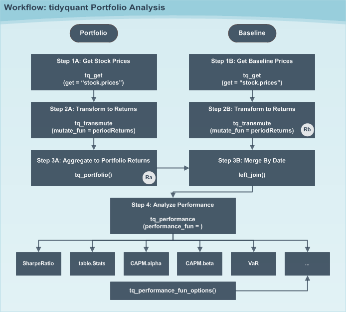
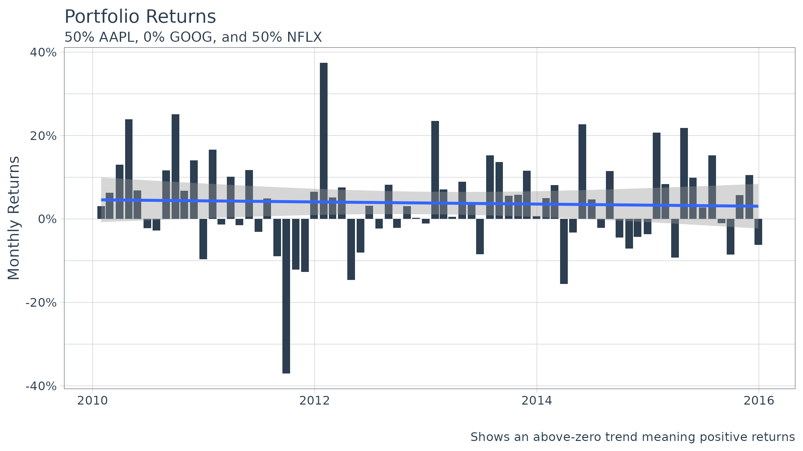
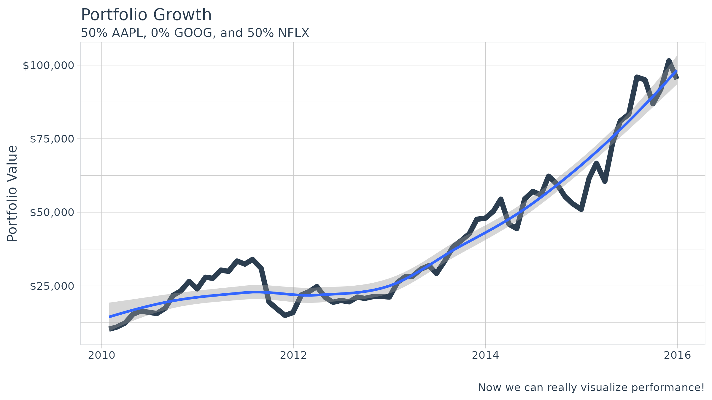
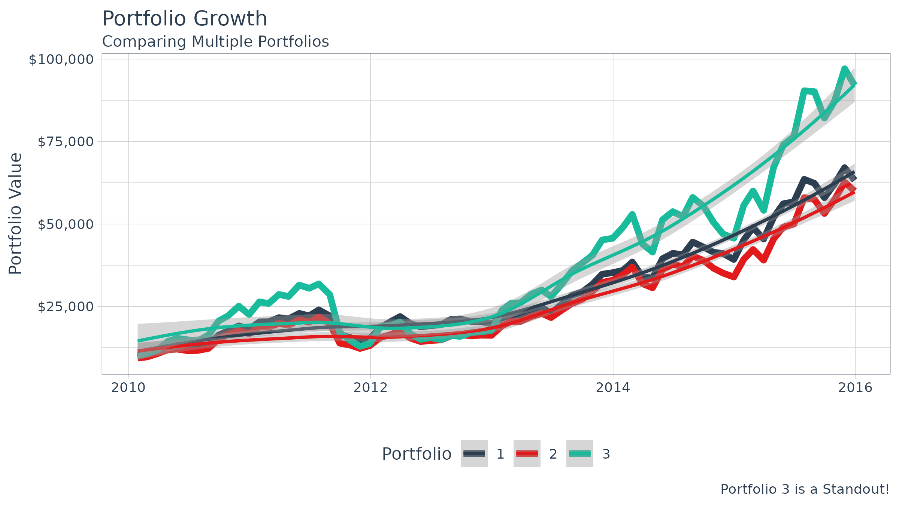

# Performance Analysis with tidyquant

> Tidy analysis of stock and portfolio return performance with
> `PerformanceAnalytics`

## Overview

Financial asset (individual stocks, securities, etc) and portfolio
(groups of stocks, securities, etc) performance analysis is a deep field
with a wide range of theories and methods for analyzing risk versus
reward. The `PerformanceAnalytics` package consolidates functions to
compute many of the most widely used performance metrics. `tidyquant`
integrates this functionality so it can be used at scale using the
split, apply, combine framework within the `tidyverse`. Two primary
functions integrate the performance analysis functionality:

- `tq_performance` implements the performance analysis functions in a
  tidy way, enabling scaling analysis using the split, apply, combine
  framework.
- `tq_portfolio` provides a useful tool set for aggregating a group of
  individual asset returns into one or many portfolios.

This vignette aims to cover three aspects of performance analysis:

1.  The general workflow to go from start to finish on both an asset and
    a portfolio level

2.  Some of the available techniques to implement once the workflow is
    implemented

3.  How to customize `tq_portfolio` and `tq_performance` using the `...`
    parameter

## 1.0 Key Concepts

An important concept is that performance analysis is based on the
statistical properties of **returns** (not prices). As a result, this
package uses inputs of **time-based returns as opposed to stock
prices**. The arguments change to `Ra` for the asset returns and `Rb`
for the baseline returns. We’ll go over how to get returns in the
[Workflow](#workflow) section.

Another important concept is the **baseline**. The baseline is what you
are measuring performance against. A baseline can be anything, but in
many cases it’s a representative average of how an investment might
perform with little or no effort. Often indexes such as the S&P500 are
used for general market performance. Other times more specific Exchange
Traded Funds (ETFs) are used such as the SPDR Technology ETF (XLK). The
important concept here is that you measure the asset performance (`Ra`)
against the baseline (`Rb`).

Now for a quick tutorial to show off the `PerformanceAnalytics` package
integration.

## 2.0 Quick Example

One of the most widely used risk to return metrics is the [Capital Asset
Pricing Model (CAPM)](https://www.investopedia.com/terms/c/capm.asp).
According to Investopedia:

> The capital asset pricing model (CAPM) is a model that describes the
> relationship between systematic risk and expected return for assets,
> particularly stocks. CAPM is widely used throughout finance for the
> pricing of risky securities, generating expected returns for assets
> given the risk of those assets and calculating costs of capital.

We’ll use the `PerformanceAnalytics` function, `table.CAPM`, to evaluate
the returns of several technology stocks against the SPDR Technology ETF
(XLK).

First, load the `tidyquant` package.

``` r
library(tidyverse)
library(tidyquant)
```

Second, get the stock returns for the stocks we wish to evaluate. We use
`tq_get` to get stock prices from Yahoo Finance, `group_by` to group the
stock prices related to each symbol, and `tq_transmute` to retrieve
period returns in a monthly periodicity using the “adjusted” stock
prices (adjusted for stock splits, which can throw off returns,
affecting the performance analysis). Review the output and see that
there are three groups of symbols indicating the data has been grouped
appropriately.

``` r
Ra <- c("AAPL", "GOOG", "NFLX") %>%
    tq_get(get  = "stock.prices",
           from = "2010-01-01",
           to   = "2015-12-31") %>%
    group_by(symbol) %>%
    tq_transmute(select     = adjusted, 
                 mutate_fun = periodReturn, 
                 period     = "monthly", 
                 col_rename = "Ra")
Ra
```

    ## # A tibble: 216 × 3
    ## # Groups:   symbol [3]
    ##    symbol date            Ra
    ##    <chr>  <date>       <dbl>
    ##  1 AAPL   2010-01-29 -0.103 
    ##  2 AAPL   2010-02-26  0.0654
    ##  3 AAPL   2010-03-31  0.148 
    ##  4 AAPL   2010-04-30  0.111 
    ##  5 AAPL   2010-05-28 -0.0161
    ##  6 AAPL   2010-06-30 -0.0208
    ##  7 AAPL   2010-07-30  0.0227
    ##  8 AAPL   2010-08-31 -0.0550
    ##  9 AAPL   2010-09-30  0.167 
    ## 10 AAPL   2010-10-29  0.0607
    ## # ℹ 206 more rows

Next, we get the baseline prices. We’ll use the XLK. Note that there is
no need to group because we are just getting one data set.

``` r
Rb <- "XLK" %>%
    tq_get(get  = "stock.prices",
           from = "2010-01-01",
           to   = "2015-12-31") %>%
    tq_transmute(select     = adjusted, 
                 mutate_fun = periodReturn, 
                 period     = "monthly", 
                 col_rename = "Rb")
Rb
```

    ## # A tibble: 72 × 2
    ##    date            Rb
    ##    <date>       <dbl>
    ##  1 2010-01-29 -0.0993
    ##  2 2010-02-26  0.0348
    ##  3 2010-03-31  0.0684
    ##  4 2010-04-30  0.0126
    ##  5 2010-05-28 -0.0748
    ##  6 2010-06-30 -0.0540
    ##  7 2010-07-30  0.0745
    ##  8 2010-08-31 -0.0561
    ##  9 2010-09-30  0.117 
    ## 10 2010-10-29  0.0578
    ## # ℹ 62 more rows

Now, we combine the two data sets using the “date” field using
`left_join` from the `dplyr` package. Review the results and see that we
still have three groups of returns, and columns “Ra” and “Rb” are
side-by-side.

``` r
RaRb <- left_join(Ra, Rb, by = c("date" = "date"))
RaRb
```

    ## # A tibble: 216 × 4
    ## # Groups:   symbol [3]
    ##    symbol date            Ra      Rb
    ##    <chr>  <date>       <dbl>   <dbl>
    ##  1 AAPL   2010-01-29 -0.103  -0.0993
    ##  2 AAPL   2010-02-26  0.0654  0.0348
    ##  3 AAPL   2010-03-31  0.148   0.0684
    ##  4 AAPL   2010-04-30  0.111   0.0126
    ##  5 AAPL   2010-05-28 -0.0161 -0.0748
    ##  6 AAPL   2010-06-30 -0.0208 -0.0540
    ##  7 AAPL   2010-07-30  0.0227  0.0745
    ##  8 AAPL   2010-08-31 -0.0550 -0.0561
    ##  9 AAPL   2010-09-30  0.167   0.117 
    ## 10 AAPL   2010-10-29  0.0607  0.0578
    ## # ℹ 206 more rows

Finally, we can retrieve the performance metrics using
[`tq_performance()`](https://business-science.github.io/tidyquant/reference/tq_performance.md).
You can use
[`tq_performance_fun_options()`](https://business-science.github.io/tidyquant/reference/tq_performance.md)
to see the full list of compatible performance functions.

``` r
RaRb_capm <- RaRb %>%
    tq_performance(Ra = Ra, 
                   Rb = Rb, 
                   performance_fun = table.CAPM)
RaRb_capm
```

    ## # A tibble: 3 × 18
    ## # Groups:   symbol [3]
    ##   symbol ActivePremium  Alpha AlphaRobust AnnualizedAlpha  Beta `Beta-`
    ##   <chr>          <dbl>  <dbl>       <dbl>           <dbl> <dbl>   <dbl>
    ## 1 AAPL           0.119 0.0089      0.0095           0.112 1.11    0.578
    ## 2 GOOG           0.034 0.0028     -0.0005           0.034 1.14    1.39 
    ## 3 NFLX           0.447 0.053       0.0439           0.859 0.384  -1.52 
    ## # ℹ 11 more variables: `Beta-Robust` <dbl>, `Beta+` <dbl>, `Beta+Robust` <dbl>,
    ## #   BetaRobust <dbl>, Correlation <dbl>, `Correlationp-value` <dbl>,
    ## #   InformationRatio <dbl>, `R-squared` <dbl>, `R-squaredRobust` <dbl>,
    ## #   TrackingError <dbl>, TreynorRatio <dbl>

We can quickly isolate attributes, such as alpha, the measure of growth,
and beta, the measure of risk.

``` r
RaRb_capm %>% select(symbol, Alpha, Beta)
```

    ## # A tibble: 3 × 3
    ## # Groups:   symbol [3]
    ##   symbol  Alpha  Beta
    ##   <chr>   <dbl> <dbl>
    ## 1 AAPL   0.0089 1.11 
    ## 2 GOOG   0.0028 1.14 
    ## 3 NFLX   0.053  0.384

With `tidyquant` it’s efficient and easy to get the CAPM information!
And, that’s just one of 129 available functions to analyze stock and
portfolio return performance. Just use
[`tq_performance_fun_options()`](https://business-science.github.io/tidyquant/reference/tq_performance.md)
to see the full list.

## 3.0 Workflow

The general workflow is shown in the diagram below. We’ll step through
the workflow first with a group of individual assets (stocks) and then
with portfolios of stocks.



Performance Analysis Workflow

### 3.1 Individual Assets

Individual assets are the simplest form of analysis because there is no
portfolio aggregation (Step 3A). We’ll re-do the “Quick Example” this
time getting the **Sharpe Ratio**, a measure of reward-to-risk.

Before we get started let’s find the performance function we want to use
from `PerformanceAnalytics`. Searching `tq_performance_fun_options`, we
can see that `SharpeRatio` is available. Type `?SharpeRatio`, and we can
see that the arguments are:

``` r
args(SharpeRatio)
```

    ## function (R, Rf = 0, p = 0.95, FUN = c("StdDev", "VaR", "ES", 
    ##     "SemiSD"), weights = NULL, annualize = FALSE, SE = FALSE, 
    ##     SE.control = NULL, ...) 
    ## NULL

We can actually skip the baseline path because the function does not
require `Rb`. The function takes `R`, which is passed using `Ra` in
`tq_performance(Ra, Rb, performance_fun, ...)`. A little bit of
foresight saves us some work.

#### Step 1A: Get stock prices

Use
[`tq_get()`](https://business-science.github.io/tidyquant/reference/tq_get.md)
to get stock prices.

``` r
stock_prices <- c("AAPL", "GOOG", "NFLX") %>%
    tq_get(get  = "stock.prices",
           from = "2010-01-01",
           to   = "2015-12-31")
stock_prices
```

    ## # A tibble: 4,527 × 8
    ##    symbol date        open  high   low close    volume adjusted
    ##    <chr>  <date>     <dbl> <dbl> <dbl> <dbl>     <dbl>    <dbl>
    ##  1 AAPL   2010-01-04  7.62  7.66  7.59  7.64 493729600     6.42
    ##  2 AAPL   2010-01-05  7.66  7.70  7.62  7.66 601904800     6.43
    ##  3 AAPL   2010-01-06  7.66  7.69  7.53  7.53 552160000     6.33
    ##  4 AAPL   2010-01-07  7.56  7.57  7.47  7.52 477131200     6.32
    ##  5 AAPL   2010-01-08  7.51  7.57  7.47  7.57 447610800     6.36
    ##  6 AAPL   2010-01-11  7.60  7.61  7.44  7.50 462229600     6.30
    ##  7 AAPL   2010-01-12  7.47  7.49  7.37  7.42 594459600     6.23
    ##  8 AAPL   2010-01-13  7.42  7.53  7.29  7.52 605892000     6.32
    ##  9 AAPL   2010-01-14  7.50  7.52  7.47  7.48 432894000     6.28
    ## 10 AAPL   2010-01-15  7.53  7.56  7.35  7.35 594067600     6.18
    ## # ℹ 4,517 more rows

#### Step 2A: Mutate to returns

Using the `tidyverse` split, apply, combine framework, we can mutate
groups of stocks by first “grouping” with `group_by` and then applying a
mutating function using `tq_transmute`. We use the `quantmod` function
`periodReturn` as the mutating function. We pass along the arguments
`period = "monthly"` to return the results in monthly periodicity. Last,
we use the `col_rename` argument to rename the output column.

``` r
stock_returns_monthly <- stock_prices %>%
    group_by(symbol) %>%
    tq_transmute(select     = adjusted, 
                 mutate_fun = periodReturn, 
                 period     = "monthly", 
                 col_rename = "Ra")
stock_returns_monthly
```

    ## # A tibble: 216 × 3
    ## # Groups:   symbol [3]
    ##    symbol date            Ra
    ##    <chr>  <date>       <dbl>
    ##  1 AAPL   2010-01-29 -0.103 
    ##  2 AAPL   2010-02-26  0.0654
    ##  3 AAPL   2010-03-31  0.148 
    ##  4 AAPL   2010-04-30  0.111 
    ##  5 AAPL   2010-05-28 -0.0161
    ##  6 AAPL   2010-06-30 -0.0208
    ##  7 AAPL   2010-07-30  0.0227
    ##  8 AAPL   2010-08-31 -0.0550
    ##  9 AAPL   2010-09-30  0.167 
    ## 10 AAPL   2010-10-29  0.0607
    ## # ℹ 206 more rows

#### Step 3A: Aggregate to Portfolio Returns (Skipped)

Step 3A can be skipped because we are only interested in the Sharpe
Ratio for *individual stocks* (not a portfolio).

Step 3B can also be skipped because the `SharpeRatio` function from
`PerformanceAnalytics` does not require a baseline.

#### Step 4: Analyze Performance

The last step is to apply the `SharpeRatio` function to our groups of
stock returns. We do this using
[`tq_performance()`](https://business-science.github.io/tidyquant/reference/tq_performance.md)
with the arguments `Ra = Ra`, `Rb = NULL` (not required), and
`performance_fun = SharpeRatio`. We can also pass other arguments of the
`SharpeRatio` function such as `Rf`, `p`, `FUN`, and `annualize`. We
will just use the defaults for this example.

``` r
stock_returns_monthly %>%
    tq_performance(
        Ra = Ra, 
        Rb = NULL, 
        performance_fun = SharpeRatio
    )
```

    ## # A tibble: 3 × 5
    ## # Groups:   symbol [3]
    ##   symbol `ESSharpe(Rf=0%,p=95%)` SemiSDSharpe(Rf=0%,p=9…¹ StdDevSharpe(Rf=0%,p…²
    ##   <chr>                    <dbl>                    <dbl>                  <dbl>
    ## 1 AAPL                     0.173                    0.297                  0.292
    ## 2 GOOG                     0.129                    0.220                  0.203
    ## 3 NFLX                     0.237                    0.313                  0.284
    ## # ℹ abbreviated names: ¹​`SemiSDSharpe(Rf=0%,p=95%)`,
    ## #   ²​`StdDevSharpe(Rf=0%,p=95%)`
    ## # ℹ 1 more variable: `VaRSharpe(Rf=0%,p=95%)` <dbl>

Now we have the Sharpe Ratio for each of the three stocks. What if we
want to adjust the parameters of the function? We can just add on the
arguments of the underlying function.

``` r
stock_returns_monthly %>%
    tq_performance(
        Ra = Ra, 
        Rb = NULL, 
        performance_fun = SharpeRatio, 
        Rf = 0.03 / 12, 
        p  = 0.99
    )
```

    ## # A tibble: 3 × 5
    ## # Groups:   symbol [3]
    ##   symbol `ESSharpe(Rf=0.2%,p=99%)` SemiSDSharpe(Rf=0.2%…¹ StdDevSharpe(Rf=0.2%…²
    ##   <chr>                      <dbl>                  <dbl>                  <dbl>
    ## 1 AAPL                      0.116                   0.262                  0.258
    ## 2 GOOG                      0.0826                  0.184                  0.170
    ## 3 NFLX                      0.115                   0.300                  0.272
    ## # ℹ abbreviated names: ¹​`SemiSDSharpe(Rf=0.2%,p=99%)`,
    ## #   ²​`StdDevSharpe(Rf=0.2%,p=99%)`
    ## # ℹ 1 more variable: `VaRSharpe(Rf=0.2%,p=99%)` <dbl>

### 3.2 Portfolios (Asset Groups)

Portfolios are slightly more complicated because we are now dealing with
groups of assets versus individual stocks, and we need to aggregate
weighted returns. Fortunately, this is only one extra step with
`tidyquant` using
[`tq_portfolio()`](https://business-science.github.io/tidyquant/reference/tq_portfolio.md).

#### Single Portfolio

Let’s recreate the CAPM analysis in the “Quick Example” this time
comparing a portfolio of technology stocks to the SPDR Technology ETF
(XLK).

##### Steps 1A and 2A: Asset Period Returns

This is the same as what we did previously to get the monthly returns
for groups of individual stock prices. We use the split, apply, combine
framework using the workflow of `tq_get`, `group_by`, and
`tq_transmute`.

``` r
stock_returns_monthly <- c("AAPL", "GOOG", "NFLX") %>%
    tq_get(get  = "stock.prices",
           from = "2010-01-01",
           to   = "2015-12-31") %>%
    group_by(symbol) %>%
    tq_transmute(select     = adjusted, 
                 mutate_fun = periodReturn, 
                 period     = "monthly", 
                 col_rename = "Ra")
stock_returns_monthly
```

    ## # A tibble: 216 × 3
    ## # Groups:   symbol [3]
    ##    symbol date            Ra
    ##    <chr>  <date>       <dbl>
    ##  1 AAPL   2010-01-29 -0.103 
    ##  2 AAPL   2010-02-26  0.0654
    ##  3 AAPL   2010-03-31  0.148 
    ##  4 AAPL   2010-04-30  0.111 
    ##  5 AAPL   2010-05-28 -0.0161
    ##  6 AAPL   2010-06-30 -0.0208
    ##  7 AAPL   2010-07-30  0.0227
    ##  8 AAPL   2010-08-31 -0.0550
    ##  9 AAPL   2010-09-30  0.167 
    ## 10 AAPL   2010-10-29  0.0607
    ## # ℹ 206 more rows

##### Steps 1B and 2B: Baseline Period Returns

This was also done previously.

``` r
baseline_returns_monthly <- "XLK" %>%
    tq_get(get  = "stock.prices",
           from = "2010-01-01",
           to   = "2015-12-31") %>%
    tq_transmute(select     = adjusted, 
                 mutate_fun = periodReturn, 
                 period     = "monthly", 
                 col_rename = "Rb")
baseline_returns_monthly
```

    ## # A tibble: 72 × 2
    ##    date            Rb
    ##    <date>       <dbl>
    ##  1 2010-01-29 -0.0993
    ##  2 2010-02-26  0.0348
    ##  3 2010-03-31  0.0684
    ##  4 2010-04-30  0.0126
    ##  5 2010-05-28 -0.0748
    ##  6 2010-06-30 -0.0540
    ##  7 2010-07-30  0.0745
    ##  8 2010-08-31 -0.0561
    ##  9 2010-09-30  0.117 
    ## 10 2010-10-29  0.0578
    ## # ℹ 62 more rows

##### Step 3A: Aggregate to Portfolio Period Returns

The `tidyquant` function,
[`tq_portfolio()`](https://business-science.github.io/tidyquant/reference/tq_portfolio.md)
aggregates a group of individual assets into a single return using a
weighted composition of the underlying assets. To do this we need to
first develop portfolio weights. There are two ways to do this for a
single portfolio:

1.  Supplying a vector of weights
2.  Supplying a two column tidy data frame (tibble) with stock symbols
    in the first column and weights to map in the second.

Suppose we want to split our portfolio evenly between AAPL and NFLX.
We’ll show this using both methods.

###### Method 1: Aggregating a Portfolio using Vector of Weights

We’ll use the weight vector, `c(0.5, 0, 0.5)`. Two important aspects to
supplying a numeric vector of weights: First, notice that the length (3)
is equal to the number of assets (3). This is a requirement. Second,
notice that the sum of the weighting vector is equal to 1. This is not
“required”, but is best practice. If the sum is not 1, the weights will
be distributed accordingly by scaling the vector to 1, and a warning
message will appear.

``` r
wts <- c(0.5, 0.0, 0.5)
portfolio_returns_monthly <- stock_returns_monthly %>%
    tq_portfolio(assets_col  = symbol, 
                 returns_col = Ra, 
                 weights     = wts, 
                 col_rename  = "Ra")
portfolio_returns_monthly
```

    ## # A tibble: 72 × 2
    ##    date            Ra
    ##    <date>       <dbl>
    ##  1 2010-01-29  0.0307
    ##  2 2010-02-26  0.0629
    ##  3 2010-03-31  0.130 
    ##  4 2010-04-30  0.239 
    ##  5 2010-05-28  0.0682
    ##  6 2010-06-30 -0.0219
    ##  7 2010-07-30 -0.0272
    ##  8 2010-08-31  0.116 
    ##  9 2010-09-30  0.251 
    ## 10 2010-10-29  0.0674
    ## # ℹ 62 more rows

We now have an aggregated portfolio that is a 50/50 blend of AAPL and
NFLX.

You may be asking why didn’t we use GOOG? **The important thing to
understand is that all of the assets from the asset returns don’t need
to be used when creating the portfolio!** This enables us to scale
individual stock returns and then vary weights to optimize the portfolio
(this will be a further subject that we address in the future!)

###### Method 2: Aggregating a Portfolio using Two Column tibble with Symbols and Weights

A possibly more useful method of aggregating returns is using a tibble
of symbols and weights that are mapped to the portfolio. We’ll recreate
the previous portfolio example using mapped weights.

``` r
wts_map <- tibble(
    symbols = c("AAPL", "NFLX"),
    weights = c(0.5, 0.5)
)
wts_map
```

    ## # A tibble: 2 × 2
    ##   symbols weights
    ##   <chr>     <dbl>
    ## 1 AAPL        0.5
    ## 2 NFLX        0.5

Next, supply this two column tibble, with symbols in the first column
and weights in the second, to the `weights` argument in
[`tq_performance()`](https://business-science.github.io/tidyquant/reference/tq_performance.md).

``` r
stock_returns_monthly %>%
    tq_portfolio(assets_col  = symbol, 
                 returns_col = Ra, 
                 weights     = wts_map, 
                 col_rename  = "Ra_using_wts_map")
```

    ## # A tibble: 72 × 2
    ##    date       Ra_using_wts_map
    ##    <date>                <dbl>
    ##  1 2010-01-29           0.0307
    ##  2 2010-02-26           0.0629
    ##  3 2010-03-31           0.130 
    ##  4 2010-04-30           0.239 
    ##  5 2010-05-28           0.0682
    ##  6 2010-06-30          -0.0219
    ##  7 2010-07-30          -0.0272
    ##  8 2010-08-31           0.116 
    ##  9 2010-09-30           0.251 
    ## 10 2010-10-29           0.0674
    ## # ℹ 62 more rows

The aggregated returns are exactly the same. The advantage with this
method is that not all symbols need to be specified. Any symbol not
specified by default gets a weight of zero.

Now, imagine if you had an entire index, such as the Russell 2000, of
2000 individual stock returns in a nice tidy data frame. It would be
very easy to adjust portfolios and compute blended returns, and you only
need to supply the symbols that you want to blend. All other symbols
default to zero!

##### Step 3B: Merging Ra and Rb

Now that we have the aggregated portfolio returns (“Ra”) from Step 3A
and the baseline returns (“Rb”) from Step 2B, we can merge to get our
consolidated table of asset and baseline returns. Nothing new here.

``` r
RaRb_single_portfolio <- left_join(portfolio_returns_monthly, 
                                   baseline_returns_monthly,
                                   by = "date")
RaRb_single_portfolio
```

    ## # A tibble: 72 × 3
    ##    date            Ra      Rb
    ##    <date>       <dbl>   <dbl>
    ##  1 2010-01-29  0.0307 -0.0993
    ##  2 2010-02-26  0.0629  0.0348
    ##  3 2010-03-31  0.130   0.0684
    ##  4 2010-04-30  0.239   0.0126
    ##  5 2010-05-28  0.0682 -0.0748
    ##  6 2010-06-30 -0.0219 -0.0540
    ##  7 2010-07-30 -0.0272  0.0745
    ##  8 2010-08-31  0.116  -0.0561
    ##  9 2010-09-30  0.251   0.117 
    ## 10 2010-10-29  0.0674  0.0578
    ## # ℹ 62 more rows

##### Step 4: Computing the CAPM Table

The CAPM table is computed with the function `table.CAPM` from
`PerformanceAnalytics`. We just perform the same task that we performed
in the “Quick Example”.

``` r
RaRb_single_portfolio %>%
    tq_performance(Ra = Ra, Rb = Rb, performance_fun = table.CAPM)
```

    ## # A tibble: 1 × 17
    ##   ActivePremium  Alpha AlphaRobust AnnualizedAlpha  Beta `Beta-` `Beta-Robust`
    ##           <dbl>  <dbl>       <dbl>           <dbl> <dbl>   <dbl>         <dbl>
    ## 1         0.327 0.0299      0.0335           0.425 0.754  -0.243        -0.203
    ## # ℹ 10 more variables: `Beta+` <dbl>, `Beta+Robust` <dbl>, BetaRobust <dbl>,
    ## #   Correlation <dbl>, `Correlationp-value` <dbl>, InformationRatio <dbl>,
    ## #   `R-squared` <dbl>, `R-squaredRobust` <dbl>, TrackingError <dbl>,
    ## #   TreynorRatio <dbl>

Now we have the CAPM performance metrics for a portfolio! While this is
cool, it’s cooler to do multiple portfolios. Let’s see how.

#### Multiple Portfolios

Once you understand the process for a single portfolio using Step 3A,
Method 2 (aggregating weights by mapping), scaling to multiple
portfolios is just building on this concept. Let’s recreate the same
example from the “Single Portfolio” Example this time with three
portfolios:

1.  50% AAPL, 25% GOOG, 25% NFLX
2.  25% AAPL, 50% GOOG, 25% NFLX
3.  25% AAPL, 25% GOOG, 50% NFLX

##### Steps 1 and 2 are the Exact Same as the Single Portfolio Example

First, get individual asset returns grouped by asset, which is the exact
same as Steps 1A and 1B from the Single Portfolio example.

``` r
stock_returns_monthly <- c("AAPL", "GOOG", "NFLX") %>%
    tq_get(get  = "stock.prices",
           from = "2010-01-01",
           to   = "2015-12-31") %>%
    group_by(symbol) %>%
    tq_transmute(select     = adjusted, 
                 mutate_fun = periodReturn, 
                 period     = "monthly", 
                 col_rename = "Ra")
```

Second, get baseline asset returns, which is the exact same as Steps 1B
and 2B from the Single Portfolio example.

``` r
baseline_returns_monthly <- "XLK" %>%
    tq_get(get  = "stock.prices",
           from = "2010-01-01",
           to   = "2015-12-31") %>%
    tq_transmute(select     = adjusted, 
                 mutate_fun = periodReturn, 
                 period     = "monthly", 
                 col_rename = "Rb")
```

##### Step 3A: Aggregate Portfolio Returns for Multiple Portfolios

This is where it gets fun. If you picked up on Single Portfolio, Step3A,
Method 2 (mapping weights), this is just an extension for multiple
portfolios.

First, we need to grow our portfolios. `tidyquant` has a handy, albeit
simple, function,
[`tq_repeat_df()`](https://business-science.github.io/tidyquant/reference/tq_portfolio.md),
for scaling a single portfolio to many. It takes a data frame, and the
number of repeats, `n`, and the `index_col_name`, which adds a
sequential index. Let’s see how it works for our example. We need three
portfolios:

``` r
stock_returns_monthly_multi <- stock_returns_monthly %>%
    tq_repeat_df(n = 3)
stock_returns_monthly_multi
```

    ## # A tibble: 648 × 4
    ## # Groups:   portfolio [3]
    ##    portfolio symbol date            Ra
    ##        <int> <chr>  <date>       <dbl>
    ##  1         1 AAPL   2010-01-29 -0.103 
    ##  2         1 AAPL   2010-02-26  0.0654
    ##  3         1 AAPL   2010-03-31  0.148 
    ##  4         1 AAPL   2010-04-30  0.111 
    ##  5         1 AAPL   2010-05-28 -0.0161
    ##  6         1 AAPL   2010-06-30 -0.0208
    ##  7         1 AAPL   2010-07-30  0.0227
    ##  8         1 AAPL   2010-08-31 -0.0550
    ##  9         1 AAPL   2010-09-30  0.167 
    ## 10         1 AAPL   2010-10-29  0.0607
    ## # ℹ 638 more rows

Examining the results, we can see that a few things happened:

1.  The length (number of rows) has tripled. This is the essence of
    `tq_repeat_df`: it grows the data frame length-wise, repeating the
    data frame `n` times. In our case, `n = 3`.
2.  Our data frame, which was grouped by symbol, was ungrouped. This is
    needed to prevent `tq_portfolio` from blending on the individual
    stocks. `tq_portfolio` only works on groups of stocks.
3.  We have a new column, named “portfolio”. The “portfolio” column name
    is a key that tells `tq_portfolio` that multiple groups exist to
    analyze. Just note that for multiple portfolio analysis, the
    “portfolio” column name is required.
4.  We have three groups of portfolios. This is what `tq_portfolio` will
    split, apply (aggregate), then combine on.

Now the tricky part: We need a new table of weights to map on. There’s a
few requirements:

1.  We must supply a three column tibble with the following columns:
    “portfolio”, asset, and weight in that order.
2.  The “portfolio” column must be named “portfolio” since this is a key
    name for mapping.
3.  The tibble must be grouped by the portfolio column.

Here’s what the weights table should look like for our example:

``` r
weights <- c(
    0.50, 0.25, 0.25,
    0.25, 0.50, 0.25,
    0.25, 0.25, 0.50
)
stocks <- c("AAPL", "GOOG", "NFLX")
weights_table <-  tibble(stocks) %>%
    tq_repeat_df(n = 3) %>%
    bind_cols(tibble(weights)) %>%
    group_by(portfolio)
weights_table
```

    ## # A tibble: 9 × 3
    ## # Groups:   portfolio [3]
    ##   portfolio stocks weights
    ##       <int> <chr>    <dbl>
    ## 1         1 AAPL      0.5 
    ## 2         1 GOOG      0.25
    ## 3         1 NFLX      0.25
    ## 4         2 AAPL      0.25
    ## 5         2 GOOG      0.5 
    ## 6         2 NFLX      0.25
    ## 7         3 AAPL      0.25
    ## 8         3 GOOG      0.25
    ## 9         3 NFLX      0.5

Now just pass the expanded `stock_returns_monthly_multi` and the
`weights_table` to `tq_portfolio` for portfolio aggregation.

``` r
portfolio_returns_monthly_multi <- stock_returns_monthly_multi %>%
    tq_portfolio(assets_col  = symbol, 
                 returns_col = Ra, 
                 weights     = weights_table, 
                 col_rename  = "Ra")
portfolio_returns_monthly_multi
```

    ## # A tibble: 216 × 3
    ## # Groups:   portfolio [3]
    ##    portfolio date              Ra
    ##        <int> <date>         <dbl>
    ##  1         1 2010-01-29 -0.0489  
    ##  2         1 2010-02-26  0.0482  
    ##  3         1 2010-03-31  0.123   
    ##  4         1 2010-04-30  0.145   
    ##  5         1 2010-05-28  0.0245  
    ##  6         1 2010-06-30 -0.0308  
    ##  7         1 2010-07-30  0.000600
    ##  8         1 2010-08-31  0.0474  
    ##  9         1 2010-09-30  0.222   
    ## 10         1 2010-10-29  0.0789  
    ## # ℹ 206 more rows

Let’s assess the output. We now have a single, “long” format data frame
of portfolio returns. It has three groups with the aggregated portfolios
blended by mapping the `weights_table`.

##### Steps 3B and 4: Merging and Assessing Performance

These steps are the exact same as the Single Portfolio example.

First, we merge with the baseline using “date” as the key.

``` r
RaRb_multiple_portfolio <- left_join(portfolio_returns_monthly_multi, 
                                     baseline_returns_monthly,
                                     by = "date")
RaRb_multiple_portfolio
```

    ## # A tibble: 216 × 4
    ## # Groups:   portfolio [3]
    ##    portfolio date              Ra      Rb
    ##        <int> <date>         <dbl>   <dbl>
    ##  1         1 2010-01-29 -0.0489   -0.0993
    ##  2         1 2010-02-26  0.0482    0.0348
    ##  3         1 2010-03-31  0.123     0.0684
    ##  4         1 2010-04-30  0.145     0.0126
    ##  5         1 2010-05-28  0.0245   -0.0748
    ##  6         1 2010-06-30 -0.0308   -0.0540
    ##  7         1 2010-07-30  0.000600  0.0745
    ##  8         1 2010-08-31  0.0474   -0.0561
    ##  9         1 2010-09-30  0.222     0.117 
    ## 10         1 2010-10-29  0.0789    0.0578
    ## # ℹ 206 more rows

Finally, we calculate the performance of each of the portfolios using
`tq_performance`. Make sure the data frame is grouped on “portfolio”.

``` r
RaRb_multiple_portfolio %>%
    tq_performance(Ra = Ra, Rb = Rb, performance_fun = table.CAPM)
```

    ## # A tibble: 3 × 18
    ## # Groups:   portfolio [3]
    ##   portfolio ActivePremium  Alpha AlphaRobust AnnualizedAlpha  Beta `Beta-`
    ##       <int>         <dbl>  <dbl>       <dbl>           <dbl> <dbl>   <dbl>
    ## 1         1         0.231 0.0193      0.0237           0.258 0.908   0.312
    ## 2         2         0.219 0.0192      0.0244           0.256 0.886   0.436
    ## 3         3         0.319 0.0308      0.0335           0.439 0.721  -0.179
    ## # ℹ 11 more variables: `Beta-Robust` <dbl>, `Beta+` <dbl>, `Beta+Robust` <dbl>,
    ## #   BetaRobust <dbl>, Correlation <dbl>, `Correlationp-value` <dbl>,
    ## #   InformationRatio <dbl>, `R-squared` <dbl>, `R-squaredRobust` <dbl>,
    ## #   TrackingError <dbl>, TreynorRatio <dbl>

Inspecting the results, we now have a multiple portfolio comparison of
the CAPM table from `PerformanceAnalytics`. We can do the same thing
with `SharpeRatio` as well.

``` r
RaRb_multiple_portfolio %>%
    tq_performance(Ra = Ra, Rb = NULL, performance_fun = SharpeRatio)
```

    ## # A tibble: 3 × 5
    ## # Groups:   portfolio [3]
    ##   portfolio ESSharpe(Rf=0%,p=95%…¹ SemiSDSharpe(Rf=0%,p…² StdDevSharpe(Rf=0%,p…³
    ##       <int>                  <dbl>                  <dbl>                  <dbl>
    ## 1         1                  0.172                  0.348                  0.355
    ## 2         2                  0.146                  0.320                  0.334
    ## 3         3                  0.150                  0.315                  0.317
    ## # ℹ abbreviated names: ¹​`ESSharpe(Rf=0%,p=95%)`, ²​`SemiSDSharpe(Rf=0%,p=95%)`,
    ## #   ³​`StdDevSharpe(Rf=0%,p=95%)`
    ## # ℹ 1 more variable: `VaRSharpe(Rf=0%,p=95%)` <dbl>

## 4.0 Available Functions

We’ve only scratched the surface of the analysis functions available
through `PerformanceAnalytics`. The list below includes all of the
compatible functions grouped by function type. The table functions are
the most useful to get a cross section of metrics. We’ll touch on a few.
We’ll also go over `VaR` and `SharpeRatio` as these are very commonly
used as performance measures.

``` r
tq_performance_fun_options()
```

    ## $table.funs
    ##  [1] "table.AnnualizedReturns" "table.Arbitrary"        
    ##  [3] "table.Autocorrelation"   "table.CAPM"             
    ##  [5] "table.CaptureRatios"     "table.Correlation"      
    ##  [7] "table.Distributions"     "table.DownsideRisk"     
    ##  [9] "table.DownsideRiskRatio" "table.DrawdownsRatio"   
    ## [11] "table.HigherMoments"     "table.InformationRatio" 
    ## [13] "table.RollingPeriods"    "table.SFM"              
    ## [15] "table.SpecificRisk"      "table.Stats"            
    ## [17] "table.TrailingPeriods"   "table.UpDownRatios"     
    ## [19] "table.Variability"      
    ## 
    ## $CAPM.funs
    ##  [1] "CAPM.alpha"       "CAPM.beta"        "CAPM.beta.bear"   "CAPM.beta.bull"  
    ##  [5] "CAPM.CML"         "CAPM.CML.slope"   "CAPM.dynamic"     "CAPM.epsilon"    
    ##  [9] "CAPM.jensenAlpha" "CAPM.RiskPremium" "CAPM.SML.slope"   "TimingRatio"     
    ## [13] "MarketTiming"    
    ## 
    ## $SFM.funs
    ## [1] "SFM.alpha"       "SFM.beta"        "SFM.CML"         "SFM.CML.slope"  
    ## [5] "SFM.dynamic"     "SFM.epsilon"     "SFM.jensenAlpha"
    ## 
    ## $descriptive.funs
    ## [1] "mean"           "sd"             "min"            "max"           
    ## [5] "cor"            "mean.geometric" "mean.stderr"    "mean.LCL"      
    ## [9] "mean.UCL"      
    ## 
    ## $annualized.funs
    ## [1] "Return.annualized"        "Return.annualized.excess"
    ## [3] "sd.annualized"            "SharpeRatio.annualized"  
    ## 
    ## $VaR.funs
    ## [1] "VaR"  "ES"   "ETL"  "CDD"  "CVaR"
    ## 
    ## $moment.funs
    ##  [1] "var"              "cov"              "skewness"         "kurtosis"        
    ##  [5] "CoVariance"       "CoSkewness"       "CoSkewnessMatrix" "CoKurtosis"      
    ##  [9] "CoKurtosisMatrix" "M3.MM"            "M4.MM"            "BetaCoVariance"  
    ## [13] "BetaCoSkewness"   "BetaCoKurtosis"  
    ## 
    ## $drawdown.funs
    ## [1] "AverageDrawdown"   "AverageLength"     "AverageRecovery"  
    ## [4] "DrawdownDeviation" "DrawdownPeak"      "maxDrawdown"      
    ## 
    ## $Bacon.risk.funs
    ## [1] "MeanAbsoluteDeviation" "Frequency"             "SharpeRatio"          
    ## [4] "MSquared"              "MSquaredExcess"        "HurstIndex"           
    ## 
    ## $Bacon.regression.funs
    ##  [1] "CAPM.alpha"       "CAPM.beta"        "CAPM.epsilon"     "CAPM.jensenAlpha"
    ##  [5] "SystematicRisk"   "SpecificRisk"     "TotalRisk"        "TreynorRatio"    
    ##  [9] "AppraisalRatio"   "FamaBeta"         "Selectivity"      "NetSelectivity"  
    ## 
    ## $Bacon.relative.risk.funs
    ## [1] "ActivePremium"    "ActiveReturn"     "TrackingError"    "InformationRatio"
    ## 
    ## $Bacon.drawdown.funs
    ## [1] "PainIndex"     "PainRatio"     "CalmarRatio"   "SterlingRatio"
    ## [5] "BurkeRatio"    "MartinRatio"   "UlcerIndex"   
    ## 
    ## $Bacon.downside.risk.funs
    ##  [1] "DownsideDeviation"     "DownsidePotential"     "DownsideFrequency"    
    ##  [4] "SemiDeviation"         "SemiVariance"          "UpsideRisk"           
    ##  [7] "UpsidePotentialRatio"  "UpsideFrequency"       "BernardoLedoitRatio"  
    ## [10] "DRatio"                "Omega"                 "OmegaSharpeRatio"     
    ## [13] "OmegaExcessReturn"     "SortinoRatio"          "M2Sortino"            
    ## [16] "Kappa"                 "VolatilitySkewness"    "AdjustedSharpeRatio"  
    ## [19] "SkewnessKurtosisRatio" "ProspectRatio"        
    ## 
    ## $misc.funs
    ## [1] "KellyRatio"   "Modigliani"   "UpDownRatios"

### 4.1 table.Stats

Returns a basic set of statistics that match the period of the data
passed in (e.g., monthly returns will get monthly statistics, daily will
be daily stats, and so on).

``` r
RaRb_multiple_portfolio %>%
    tq_performance(Ra = Ra, Rb = NULL, performance_fun = table.Stats)
```

    ## # A tibble: 3 × 17
    ## # Groups:   portfolio [3]
    ##   portfolio ArithmeticMean GeometricMean Kurtosis `LCLMean(0.95)` Maximum Median
    ##       <int>          <dbl>         <dbl>    <dbl>           <dbl>   <dbl>  <dbl>
    ## 1         1         0.0293        0.0259     1.14          0.0099   0.222 0.0307
    ## 2         2         0.029         0.0252     1.65          0.0086   0.227 0.037 
    ## 3         3         0.0388        0.0313     1.81          0.01     0.370 0.046 
    ## # ℹ 10 more variables: Minimum <dbl>, NAs <dbl>, Observations <dbl>,
    ## #   Quartile1 <dbl>, Quartile3 <dbl>, SEMean <dbl>, Skewness <dbl>,
    ## #   Stdev <dbl>, `UCLMean(0.95)` <dbl>, Variance <dbl>

### 4.2 table.CAPM

Takes a set of returns and relates them to a benchmark return. Provides
a set of measures related to an excess return single factor model, or
CAPM.

``` r
RaRb_multiple_portfolio %>%
    tq_performance(Ra = Ra, Rb = Rb, performance_fun = table.CAPM)
```

    ## # A tibble: 3 × 18
    ## # Groups:   portfolio [3]
    ##   portfolio ActivePremium  Alpha AlphaRobust AnnualizedAlpha  Beta `Beta-`
    ##       <int>         <dbl>  <dbl>       <dbl>           <dbl> <dbl>   <dbl>
    ## 1         1         0.231 0.0193      0.0237           0.258 0.908   0.312
    ## 2         2         0.219 0.0192      0.0244           0.256 0.886   0.436
    ## 3         3         0.319 0.0308      0.0335           0.439 0.721  -0.179
    ## # ℹ 11 more variables: `Beta-Robust` <dbl>, `Beta+` <dbl>, `Beta+Robust` <dbl>,
    ## #   BetaRobust <dbl>, Correlation <dbl>, `Correlationp-value` <dbl>,
    ## #   InformationRatio <dbl>, `R-squared` <dbl>, `R-squaredRobust` <dbl>,
    ## #   TrackingError <dbl>, TreynorRatio <dbl>

### 4.3 table.AnnualizedReturns

Table of Annualized Return, Annualized Std Dev, and Annualized Sharpe.

``` r
RaRb_multiple_portfolio %>%
    tq_performance(Ra = Ra, Rb = NULL, performance_fun = table.AnnualizedReturns)
```

    ## # A tibble: 3 × 4
    ## # Groups:   portfolio [3]
    ##   portfolio AnnualizedReturn `AnnualizedSharpe(Rf=0%)` AnnualizedStdDev
    ##       <int>            <dbl>                     <dbl>            <dbl>
    ## 1         1            0.360                      1.26            0.286
    ## 2         2            0.348                      1.16            0.301
    ## 3         3            0.448                      1.06            0.424

### 4.4 table.Correlation

This is a wrapper for calculating correlation and significance against
each column of the data provided.

``` r
RaRb_multiple_portfolio %>%
    tq_performance(Ra = Ra, Rb = Rb, performance_fun = table.Correlation)
```

    ## # A tibble: 3 × 5
    ## # Groups:   portfolio [3]
    ##   portfolio `p-value` `Lower CI` `Upper CI` to.Rb
    ##       <int>     <dbl>      <dbl>      <dbl> <dbl>
    ## 1         1 0.0000284     0.270       0.634 0.472
    ## 2         2 0.000122      0.229       0.608 0.438
    ## 3         3 0.0325        0.0220      0.457 0.252

### 4.5 table.DownsideRisk

Creates a table of estimates of downside risk measures for comparison
across multiple instruments or funds.

``` r
RaRb_multiple_portfolio %>%
    tq_performance(Ra = Ra, Rb = NULL, performance_fun = table.DownsideRisk)
```

    ## # A tibble: 3 × 12
    ## # Groups:   portfolio [3]
    ##   portfolio DownsideDeviation(0%…¹ DownsideDeviation(MA…² DownsideDeviation(Rf…³
    ##       <int>                  <dbl>                  <dbl>                  <dbl>
    ## 1         1                 0.045                  0.0488                 0.045 
    ## 2         2                 0.0501                 0.0538                 0.0501
    ## 3         3                 0.0684                 0.0721                 0.0684
    ## # ℹ abbreviated names: ¹​`DownsideDeviation(0%)`, ²​`DownsideDeviation(MAR=10%)`,
    ## #   ³​`DownsideDeviation(Rf=0%)`
    ## # ℹ 8 more variables: GainDeviation <dbl>, `HistoricalES(95%)` <dbl>,
    ## #   `HistoricalVaR(95%)` <dbl>, LossDeviation <dbl>, MaximumDrawdown <dbl>,
    ## #   `ModifiedES(95%)` <dbl>, `ModifiedVaR(95%)` <dbl>, SemiDeviation <dbl>

### 4.6 table.DownsideRiskRatio

Table of Monthly downside risk, Annualized downside risk, Downside
potential, Omega, Sortino ratio, Upside potential, Upside potential
ratio and Omega-Sharpe ratio.

``` r
RaRb_multiple_portfolio %>%
    tq_performance(Ra = Ra, Rb = NULL, performance_fun = table.DownsideRiskRatio)
```

    ## # A tibble: 3 × 9
    ## # Groups:   portfolio [3]
    ##   portfolio Annualiseddownsiderisk Downsidepotential monthlydownsiderisk Omega
    ##       <int>                  <dbl>             <dbl>               <dbl> <dbl>
    ## 1         1                  0.156            0.0198              0.045   2.48
    ## 2         2                  0.173            0.0217              0.0501  2.34
    ## 3         3                  0.237            0.0294              0.0684  2.32
    ## # ℹ 4 more variables: `Omega-sharperatio` <dbl>, Sortinoratio <dbl>,
    ## #   Upsidepotential <dbl>, Upsidepotentialratio <dbl>

### 4.7 table.HigherMoments

Summary of the higher moments and Co-Moments of the return distribution.
Used to determine diversification potential. Also called “systematic”
moments by several papers.

``` r
RaRb_multiple_portfolio %>%
    tq_performance(Ra = Ra, Rb = Rb, performance_fun = table.HigherMoments)
```

    ## # A tibble: 3 × 6
    ## # Groups:   portfolio [3]
    ##   portfolio BetaCoKurtosis BetaCoSkewness BetaCoVariance CoKurtosis CoSkewness
    ##       <int>          <dbl>          <dbl>          <dbl>      <dbl>      <dbl>
    ## 1         1          0.756          0.196          0.908          0          0
    ## 2         2          0.772          1.71           0.886          0          0
    ## 3         3          0.455          0.369          0.721          0          0

### 4.8 table.InformationRatio

Table of Tracking error, Annualized tracking error and Information
ratio.

``` r
RaRb_multiple_portfolio %>%
    tq_performance(Ra = Ra, Rb = Rb, performance_fun = table.InformationRatio)
```

    ## # A tibble: 3 × 4
    ## # Groups:   portfolio [3]
    ##   portfolio AnnualisedTrackingError InformationRatio TrackingError
    ##       <int>                   <dbl>            <dbl>         <dbl>
    ## 1         1                   0.252            0.917        0.0728
    ## 2         2                   0.271            0.809        0.0782
    ## 3         3                   0.412            0.774        0.119

### 4.9 table.Variability

Table of Mean absolute difference, Monthly standard deviation and
annualized standard deviation.

``` r
RaRb_multiple_portfolio %>%
    tq_performance(Ra = Ra, Rb = NULL, performance_fun = table.Variability)
```

    ## # A tibble: 3 × 4
    ## # Groups:   portfolio [3]
    ##   portfolio AnnualizedStdDev MeanAbsolutedeviation monthlyStdDev
    ##       <int>            <dbl>                 <dbl>         <dbl>
    ## 1         1            0.286                0.0658        0.0825
    ## 2         2            0.301                0.0679        0.0868
    ## 3         3            0.424                0.091         0.122

### 4.10 VaR

Calculates Value-at-Risk (VaR) for univariate, component, and marginal
cases using a variety of analytical methods.

``` r
RaRb_multiple_portfolio %>%
    tq_performance(Ra = Ra, Rb = NULL, performance_fun = VaR)
```

    ## # A tibble: 3 × 2
    ## # Groups:   portfolio [3]
    ##   portfolio    VaR
    ##       <int>  <dbl>
    ## 1         1 -0.111
    ## 2         2 -0.123
    ## 3         3 -0.163

### 4.11 SharpeRatio

The Sharpe ratio is simply the return per unit of risk (represented by
variability). In the classic case, the unit of risk is the standard
deviation of the returns.

``` r
RaRb_multiple_portfolio %>%
    tq_performance(Ra = Ra, Rb = NULL, performance_fun = SharpeRatio)
```

    ## # A tibble: 3 × 5
    ## # Groups:   portfolio [3]
    ##   portfolio ESSharpe(Rf=0%,p=95%…¹ SemiSDSharpe(Rf=0%,p…² StdDevSharpe(Rf=0%,p…³
    ##       <int>                  <dbl>                  <dbl>                  <dbl>
    ## 1         1                  0.172                  0.348                  0.355
    ## 2         2                  0.146                  0.320                  0.334
    ## 3         3                  0.150                  0.315                  0.317
    ## # ℹ abbreviated names: ¹​`ESSharpe(Rf=0%,p=95%)`, ²​`SemiSDSharpe(Rf=0%,p=95%)`,
    ## #   ³​`StdDevSharpe(Rf=0%,p=95%)`
    ## # ℹ 1 more variable: `VaRSharpe(Rf=0%,p=95%)` <dbl>

## 5.0 Customizing using the …

One of the best features of `tq_portfolio` and `tq_performance` is to be
able to pass features through to the underlying functions. After all,
these are just wrappers for `PerformanceAnalytics`, so you probably want
to be able **to make full use of the underlying functions**. Passing
through parameters using the `...` can be incredibly useful, so let’s
see how.

### 5.1 Customizing tq_portfolio

The `tq_portfolio` function is a wrapper for `Return.portfolio`. This
means that during the portfolio aggregation process, we can make use of
most of the `Return.portfolio` arguments such as `wealth.index`,
`contribution`, `geometric`, `rebalance_on`, and `value`. Here’s the
arguments of the underlying function:

``` r
args(Return.portfolio)
```

    ## function (R, weights = NULL, wealth.index = FALSE, contribution = FALSE, 
    ##     geometric = TRUE, rebalance_on = c(NA, "years", "quarters", 
    ##         "months", "weeks", "days"), value = 1, verbose = FALSE, 
    ##     ...) 
    ## NULL

Let’s see an example of passing parameters to the `...`. Suppose we want
to instead see how our money is grows for a \$10,000 investment. We’ll
use the “Single Portfolio” example, where our portfolio mix was 50%
AAPL, 0% GOOG, and 50% NFLX.

Method 3A, Aggregating Portfolio Returns, showed us two methods to
aggregate for a single portfolio. Either will work for this example. For
simplicity, we’ll examine the first.

Here’s the original output, without adjusting parameters.

``` r
wts <- c(0.5, 0.0, 0.5)
portfolio_returns_monthly <- stock_returns_monthly %>%
    tq_portfolio(assets_col  = symbol, 
                 returns_col = Ra, 
                 weights     = wts, 
                 col_rename  = "Ra")
```

``` r
portfolio_returns_monthly %>%
    ggplot(aes(x = date, y = Ra)) +
    geom_bar(stat = "identity", fill = palette_light()[[1]]) +
    labs(title = "Portfolio Returns",
         subtitle = "50% AAPL, 0% GOOG, and 50% NFLX",
         caption = "Shows an above-zero trend meaning positive returns",
         x = "", y = "Monthly Returns") +
    geom_smooth(method = "lm") +
    theme_tq() +
    scale_color_tq() +
    scale_y_continuous(labels = scales::percent)
```



This is good, but we want to see how our \$10,000 initial investment is
growing. This is simple with the underlying `Return.portfolio` argument,
`wealth.index = TRUE`. All we need to do is add these as additional
parameters to `tq_portfolio`!

``` r
wts <- c(0.5, 0, 0.5)
portfolio_growth_monthly <- stock_returns_monthly %>%
    tq_portfolio(assets_col   = symbol, 
                 returns_col  = Ra, 
                 weights      = wts, 
                 col_rename   = "investment.growth",
                 wealth.index = TRUE) %>%
    mutate(investment.growth = investment.growth * 10000)
```

``` r
portfolio_growth_monthly %>%
    ggplot(aes(x = date, y = investment.growth)) +
    geom_line(linewidth = 2, color = palette_light()[[1]]) +
    labs(title = "Portfolio Growth",
         subtitle = "50% AAPL, 0% GOOG, and 50% NFLX",
         caption = "Now we can really visualize performance!",
         x = "", y = "Portfolio Value") +
    geom_smooth(method = "loess") +
    theme_tq() +
    scale_color_tq() +
    scale_y_continuous(labels = scales::dollar)
```



Finally, taking this one step further, we apply the same process to the
“Multiple Portfolio” example:

1.  50% AAPL, 25% GOOG, 25% NFLX
2.  25% AAPL, 50% GOOG, 25% NFLX
3.  25% AAPL, 25% GOOG, 50% NFLX

``` r
portfolio_growth_monthly_multi <- stock_returns_monthly_multi %>%
    tq_portfolio(assets_col   = symbol, 
                 returns_col  = Ra, 
                 weights      = weights_table, 
                 col_rename   = "investment.growth",
                 wealth.index = TRUE) %>%
    mutate(investment.growth = investment.growth * 10000)
```

``` r
portfolio_growth_monthly_multi %>%
    ggplot(aes(x = date, y = investment.growth, color = factor(portfolio))) +
    geom_line(linewidth = 2) +
    labs(title = "Portfolio Growth",
         subtitle = "Comparing Multiple Portfolios",
         caption = "Portfolio 3 is a Standout!",
         x = "", y = "Portfolio Value",
         color = "Portfolio") +
    geom_smooth(method = "loess") +
    theme_tq() +
    scale_color_tq() +
    scale_y_continuous(labels = scales::dollar)
```



### 5.2 Customizing tq_performance

Finally, the same concept of passing arguments works with all the
`tidyquant` functions that are wrappers including `tq_transmute`,
`tq_mutate`, `tq_performance`, etc. Let’s use a final example with the
`SharpeRatio`, which has the following arguments.

``` r
args(SharpeRatio)
```

    ## function (R, Rf = 0, p = 0.95, FUN = c("StdDev", "VaR", "ES", 
    ##     "SemiSD"), weights = NULL, annualize = FALSE, SE = FALSE, 
    ##     SE.control = NULL, ...) 
    ## NULL

We can see that the parameters `Rf` allows us to apply a risk-free rate
and `p` allows us to vary the confidence interval. Let’s compare the
Sharpe ratio with an annualized risk-free rate of 3% and a confidence
interval of 0.99.

Default:

``` r
RaRb_multiple_portfolio %>%
    tq_performance(Ra              = Ra, 
                   performance_fun = SharpeRatio)
```

    ## # A tibble: 3 × 5
    ## # Groups:   portfolio [3]
    ##   portfolio ESSharpe(Rf=0%,p=95%…¹ SemiSDSharpe(Rf=0%,p…² StdDevSharpe(Rf=0%,p…³
    ##       <int>                  <dbl>                  <dbl>                  <dbl>
    ## 1         1                  0.172                  0.348                  0.355
    ## 2         2                  0.146                  0.320                  0.334
    ## 3         3                  0.150                  0.315                  0.317
    ## # ℹ abbreviated names: ¹​`ESSharpe(Rf=0%,p=95%)`, ²​`SemiSDSharpe(Rf=0%,p=95%)`,
    ## #   ³​`StdDevSharpe(Rf=0%,p=95%)`
    ## # ℹ 1 more variable: `VaRSharpe(Rf=0%,p=95%)` <dbl>

With `Rf = 0.03 / 12` (adjusted for monthly periodicity):

``` r
RaRb_multiple_portfolio %>%
    tq_performance(Ra              = Ra, 
                   performance_fun = SharpeRatio,
                   Rf              = 0.03 / 12)
```

    ## # A tibble: 3 × 5
    ## # Groups:   portfolio [3]
    ##   portfolio ESSharpe(Rf=0.2%,p=9…¹ SemiSDSharpe(Rf=0.2%…² StdDevSharpe(Rf=0.2%…³
    ##       <int>                  <dbl>                  <dbl>                  <dbl>
    ## 1         1                  0.157                  0.318                  0.325
    ## 2         2                  0.134                  0.292                  0.305
    ## 3         3                  0.141                  0.295                  0.296
    ## # ℹ abbreviated names: ¹​`ESSharpe(Rf=0.2%,p=95%)`,
    ## #   ²​`SemiSDSharpe(Rf=0.2%,p=95%)`, ³​`StdDevSharpe(Rf=0.2%,p=95%)`
    ## # ℹ 1 more variable: `VaRSharpe(Rf=0.2%,p=95%)` <dbl>

And, with both `Rf = 0.03 / 12` (adjusted for monthly periodicity) and
`p = 0.99`:

``` r
RaRb_multiple_portfolio %>%
    tq_performance(Ra              = Ra, 
                   performance_fun = SharpeRatio,
                   Rf              = 0.03 / 12, 
                   p               = 0.99)
```

    ## # A tibble: 3 × 5
    ## # Groups:   portfolio [3]
    ##   portfolio ESSharpe(Rf=0.2%,p=9…¹ SemiSDSharpe(Rf=0.2%…² StdDevSharpe(Rf=0.2%…³
    ##       <int>                  <dbl>                  <dbl>                  <dbl>
    ## 1         1                 0.105                   0.318                  0.325
    ## 2         2                 0.0952                  0.292                  0.305
    ## 3         3                 0.0915                  0.295                  0.296
    ## # ℹ abbreviated names: ¹​`ESSharpe(Rf=0.2%,p=99%)`,
    ## #   ²​`SemiSDSharpe(Rf=0.2%,p=99%)`, ³​`StdDevSharpe(Rf=0.2%,p=99%)`
    ## # ℹ 1 more variable: `VaRSharpe(Rf=0.2%,p=99%)` <dbl>
