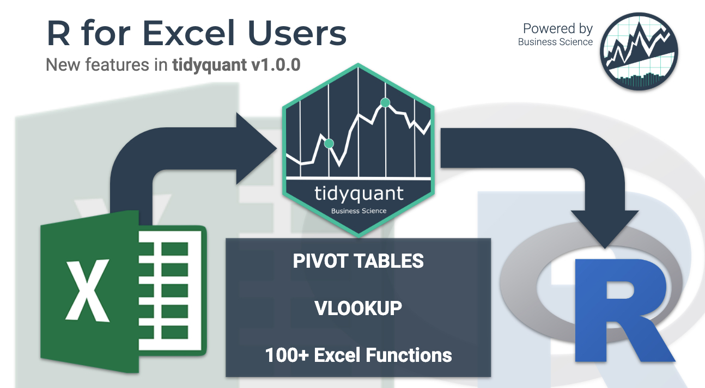

# Excel in R with tidyquant

**New business and financial analysts are finding R every day.** Most of
these new userRs (R users) are coming from a non-programming background.
They have ample domain experience in functions like finance, marketing,
and business, but their tool of choice is Excel (or more recently
Tableau & PowerBI).

**Learning R can be a major hurdle.** You need to learn data structures,
algorithms, data science, machine learning, web applications with Shiny
and more to be able to accomplish a basic dashboard. This is a BIG ASK
for non-coders. This is the problem I aim to begin solving with the
upcoming release of tidyquant v1.0.0. [**Read the updated “R for Excel
Users” Tutorial on Business
Science.**](https://www.business-science.io/finance/2020/02/26/r-for-excel-users.html)

[**R for Excel Users
Tutorial**](https://www.business-science.io/finance/2020/02/26/r-for-excel-users.html)
