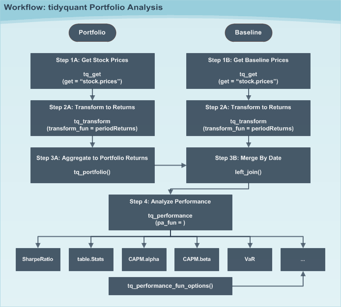

```{r, echo = FALSE, message = FALSE, warning = FALSE}
knitr::opts_chunk$set(message = FALSE,
                      warning = FALSE,
                      fig.width = 8, 
                      fig.height = 4.5,
                      fig.align = 'center',
                      out.width='95%', 
                      dpi = 200)
library(tidyquant)
# devtools::load_all() # Travis CI fails on load_all()
```

> Tidy analysis of stock and portfolio return performance with `PerformanceAnalytics`

# Overview

Financial asset (individual stocks, securities, etc) and portfolio (groups of stocks, securities, etc) performance analysis is a deep field with a wide range of theories and methods for analyzing risk versus reward. The `PerformanceAnalytics` package consolidates functions to compute many of the most widely used performance metrics. `tidquant` integrates this functionality so it can be used at scale using the split, apply, combine framework within the `tidyverse`. Two primary functions integrate the performance analysis functionality:

* `tq_performance` implements the performance analysis functions in a tidy way, enabling scaling analysis using the split, apply, combine framework.
* `tq_portfolio` provides a useful tool set for aggregating a group of individual asset returns into one or many portfolios. 

This vignette aims to cover three aspects of performance analysis: 

1. The general workflow to go from start to finish on both an asset and a portfolio level 

2. Some of the available techniques to implement once the workflow is implemented

3. How to customize `tq_portfolio` and `tq_performance` using the `...` parameter

# Key Concepts

An important concept is that performance analysis is based on the statistical properties of __returns__ (not prices). As a result, this package uses inputs of __time-based returns as opposed to stock prices__. The arguments change to `Ra` for the asset returns and `Rb` for the baseline returns. We'll go over how to get returns in the [Workflow](#workflow) section.

Another important concept is the __baseline__. The baseline is what you are measuring performance against. A baseline can be anything, but in many cases it's a representative average of how an investment might perform with little or no effort. Often indexes such as the S&amp;P500 are used for general market performance. Other times more specific Exchange Traded Funds (ETFs) are used such as the [SPDR Technology ETF (XLK)](http://www.sectorspdr.com/sectorspdr/sector/xlk/holdings). The important concept here is that you measure the asset performance (`Ra`) against the baseline (`Rb`).

Now for a quick tutorial to show off the `PerformanceAnalytics` package integration.

# Quick Example

One of the most widely used risk to return metrics is the [Capital Asset Pricing Model (CAPM)](http://www.investopedia.com/terms/c/capm.asp). According to Investopedia:

>The capital asset pricing model (CAPM) is a model that describes the relationship between systematic risk and expected return for assets, particularly stocks. CAPM is widely used throughout finance for the pricing of risky securities, generating expected returns for assets given the risk of those assets and calculating costs of capital.

We'll use the `PerformanceAnalytics` function, `table.CAPM`, to evaluate the returns of several technology stocks against the SPDR Technology ETF (XLK). 

First, load the `tidyquant` package.

```{r, eval = F}
library(tidyquant)
```

Second, get the stock returns for the stocks we wish to evaluate. We use `tq_get` to get stock prices from Yahoo Finance, `group_by` to group the stock prices related to each symbol, and `tq_transmute` to retrieve period returns in a monthly periodicity using the "adjusted" stock prices (adjusted for stock splits, which can throw off returns, affecting the performance analysis). Review the output and see that there are three groups of symbols indicating the data has been grouped appropriately.

```{r}
Ra <- c("AAPL", "GOOG", "NFLX") %>%
    tq_get(get  = "stock.prices",
           from = "2010-01-01",
           to   = "2015-12-31") %>%
    group_by(symbol) %>%
    tq_transmute(select     = adjusted, 
                 mutate_fun = periodReturn, 
                 period     = "monthly", 
                 col_rename = "Ra")
Ra
```

Next, we get the baseline prices. We'll use the XLK. Note that there is no need to group because we are just getting one data set.

```{r}
Rb <- "XLK" %>%
    tq_get(get  = "stock.prices",
           from = "2010-01-01",
           to   = "2015-12-31") %>%
    tq_transmute(select     = adjusted, 
                 mutate_fun = periodReturn, 
                 period     = "monthly", 
                 col_rename = "Rb")
Rb
```

Now, we combine the two data sets using the "date" field using `left_join` from the `dplyr` package. Review the results and see that we still have three groups of returns, and columns "Ra" and "Rb" are side-by-side.

```{r}
RaRb <- left_join(Ra, Rb, by = c("date" = "date"))
RaRb
```

Finally, we can retrieve the performance metrics using `tq_performance()`. You can use `tq_performance_fun_options()` to see the full list of compatible performance functions.

```{r}
RaRb_capm <- RaRb %>%
    tq_performance(Ra = Ra, 
                   Rb = Rb, 
                   performance_fun = table.CAPM)
RaRb_capm
```

We can quickly isolate attributes, such as alpha, the measure of growth, and beta, the measure of risk.

```{r}
RaRb_capm %>%
    select(Alpha, Beta)
```

With `tidyquant` it's efficient and easy to get the CAPM information! And, that's just one of `r tq_performance_fun_options() %>% unlist() %>% length()` available functions to analyze stock and portfolio return performance. Just use `tq_performance_fun_options()` to see the full list.


<a class="anchor" id="workflow"></a>

# Workflow

The general workflow is shown in the diagram below. We'll step through the workflow first with a group of individual assets (stocks) and then with portfolios of stocks. 



## Individual Assets

Individual assets are the simplest form of analysis because there is no portfolio aggregation (Step 3A). We'll re-do the "Quick Example" this time getting the __Sharpe Ratio__, a measure of reward-to-risk. 

Before we get started let's find the performance function we want to use from `PerformanceAnalytics`. Searching `tq_performance_fun_options`, we can see that `SharpeRatio` is available. Type `?SharpeRatio`, and we can see that the arguments are:

``` {r}
args(SharpeRatio)
```

We can actually skip the baseline path because the function does not require `Rb`. The function takes `R`, which is passed using `Ra` in `tq_performance(Ra, Rb, performance_fun, ...)`. A little bit of foresight saves us some work. 

### Step 1A: Get stock prices

Use `tq_get()` to get stock prices.

```{r}
stock_prices <- c("AAPL", "GOOG", "NFLX") %>%
    tq_get(get  = "stock.prices",
           from = "2010-01-01",
           to   = "2015-12-31")
stock_prices
```

### Step 2A: Mutate to returns

Using the `tidyverse` split, apply, combine framework, we can mutate groups of stocks by first "grouping" with `group_by` and then applying a mutating function using `tq_transmute`. We use the `quantmod` function `periodReturn` as the mutating function. We pass along the arguments `period = "monthly"` to return the results in monthly periodicity. Last, we use the `col_rename` argument to rename the output column. 

```{r}
stock_returns_monthly <- stock_prices %>%
    group_by(symbol) %>%
    tq_transmute(select     = adjusted, 
                 mutate_fun = periodReturn, 
                 period     = "monthly", 
                 col_rename = "Ra")
stock_returns_monthly
```

### Step 3A: Aggregate to Portfolio Returns (Skipped)

Step 3A can be skipped because we are only interested in the Sharpe Ratio for _individual stocks_ (not a portfolio).

Step 3B can also be skipped because the `SharpeRatio` function from `PerformanceAnalytics` does not require a baseline.

### Step 4: Analyze Performance

The last step is to apply the `SharpeRatio` function to our groups of stock returns. We do this using `tq_performance()` with the arguments `Ra = Ra`, `Rb = NULL` (not required), and `performance_fun = SharpeRatio`. We can also pass other arguments of the `SharpeRatio` function such as `Rf`, `p`, `FUN`,  and `annualize`. We will just use the defaults for this example.

```{r}
stock_returns_monthly %>%
    tq_performance(Ra = Ra, 
                   Rb = NULL, 
                   performance_fun = SharpeRatio)
```

Now we have the Sharpe Ratio for each of the three stocks. What if we want to adjust the parameters of the function? We can just add on the arguments of the underlying function.


```{r}
stock_returns_monthly %>%
    tq_performance(Ra = Ra, 
                   Rb = NULL, 
                   performance_fun = SharpeRatio, 
                   Rf = 0.03 / 12, 
                   p = 0.99)
```


## Portfolios (Asset Groups)

Portfolios are slightly more complicated because we are now dealing with groups of assets versus individual stocks, and we need to aggregate weighted returns. Fortunately, this is only one extra step with `tidyquant` using `tq_portfolio()`.

### Single Portfolio

Let's recreate the CAPM analysis in the "Quick Example" this time comparing a portfolio of technology stocks to the SPDR Technology ETF (XLK).

#### Steps 1A and 2A: Asset Period Returns

This is the same as what we did previously to get the monthly returns for groups of individual stock prices. We use the split, apply, combine framework using the workflow of `tq_get`, `group_by`, and `tq_transmute`.

```{r, eval = F}
stock_returns_monthly <- c("AAPL", "GOOG", "NFLX") %>%
    tq_get(get  = "stock.prices",
           from = "2010-01-01",
           to   = "2015-12-31") %>%
    group_by(symbol) %>%
    tq_transmute(select     = adjusted, 
                 mutate_fun = periodReturn, 
                 period     = "monthly", 
                 col_rename = "Ra")
stock_returns_monthly
```

```{r, echo = F}
# NOT SHOWN
stock_returns_monthly <- Ra
stock_returns_monthly
```

#### Steps 1B and 2B: Baseline Period Returns

This was also done previously. 

```{r, eval = F}
baseline_returns_monthly <- "XLK" %>%
    tq_get(get  = "stock.prices",
           from = "2010-01-01",
           to   = "2015-12-31") %>%
    tq_transmute(select     = adjusted, 
                 mutate_fun = periodReturn, 
                 period     = "monthly", 
                 col_rename = "Rb")
baseline_returns_monthly
```

```{r, echo = F}
# NOT SHOWN
baseline_returns_monthly <- Rb
baseline_returns_monthly
```

#### Step 3A: Aggregate to Portfolio Period Returns

The `tidyquant` function, `tq_portfolio()` aggregates a group of individual assets into a single return using a weighted composition of the underlying assets. To do this we need to first develop portfolio weights. There are two ways to do this for a single portfolio:

1. Supplying a vector of weights
2. Supplying a two column tidy data frame (tibble) with stock symbols in the first column and weights to map in the second.

Suppose we want to split our portfolio evenly between AAPL and NFLX. We'll show this using both methods.

##### Method 1: Aggregating a Portfolio using Vector of Weights

We'll use the weight vector, `c(0.5, 0, 0.5)`. Two important aspects to supplying a numeric vector of weights: First, notice that the length (3) is equal to the number of assets (3). This is a requirement. Second, notice that the sum of the weighting vector is equal to 1. This is not "required", but is best practice. If the sum is not 1, the weights will be distributed accordingly by scaling the vector to 1, and a warning message will appear.

```{r}
wts <- c(0.5, 0.0, 0.5)
portfolio_returns_monthly <- stock_returns_monthly %>%
    tq_portfolio(assets_col  = symbol, 
                 returns_col = Ra, 
                 weights     = wts, 
                 col_rename  = "Ra")
portfolio_returns_monthly
```

We now have an aggregated portfolio that is a 50/50 blend of AAPL and NFLX. 

You may be asking why didn't we use GOOG? __The important thing to understand is that all of the assets from the asset returns don't need to be used when creating the portfolio!__ This enables us to scale individual stock returns and then vary weights to optimize the portfolio (this will be a further subject that we address in the future!)

##### Method 2: Aggregating a Portfolio using Two Column Tibble with Symbols and Weights

A possibly more useful method of aggregating returns is using a tibble of symbols and weights that are mapped to the portfolio. We'll recreate the previous portfolio example using mapped weights.

```{r}
wts_map <- tibble(
    symbols = c("AAPL", "NFLX"),
    weights = c(0.5, 0.5)
)
wts_map
```

Next, supply this two column tibble, with symbols in the first column and weights in the second, to the `weights` argument in `tq_performance()`. 

```{r}
stock_returns_monthly %>%
    tq_portfolio(assets_col  = symbol, 
                 returns_col = Ra, 
                 weights     = wts_map, 
                 col_rename  = "Ra_using_wts_map")
```

The aggregated returns are exactly the same. The advantage with this method is that not all symbols need to be specified. Any symbol not specified by default gets a weight of zero. 

Now, imagine if you had an entire index, such as the Russell 2000, of 2000 individual stock returns in a nice tidy data frame. It would be very easy to adjust portfolios and compute blended returns, and you only need to supply the symbols that you want to blend. All other symbols default to zero!  

#### Step 3B: Merging Ra and Rb

Now that we have the aggregated portfolio returns ("Ra") from Step 3A and the baseline returns ("Rb") from Step 2B, we can merge to get our consolidated table of asset and baseline returns. Nothing new here.

```{r}
RaRb_single_portfolio <- left_join(portfolio_returns_monthly, 
                                   baseline_returns_monthly,
                                   by = "date")
RaRb_single_portfolio
```


#### Step 4: Computing the CAPM Table

The CAPM table is computed with the function `table.CAPM` from `PerformanceAnalytics`. We just perform the same task that we performed in the "Quick Example".

```{r}
RaRb_single_portfolio %>%
    tq_performance(Ra = Ra, Rb = Rb, performance_fun = table.CAPM)
```

Now we have the CAPM performance metrics for a portfolio! While this is cool, it's cooler to do multiple portfolios. Let's see how.

### Multiple Portfolios

Once you understand the process for a single portfolio using Step 3A, Method 2 (aggregating weights by mapping), scaling to multiple portfolios is just building on this concept. Let's recreate the same example from the "Single Portfolio" Example this time with three portfolios:

1. 50% AAPL, 25% GOOG, 25% NFLX
2. 25% AAPL, 50% GOOG, 25% NFLX
3. 25% AAPL, 25% GOOG, 50% NFLX

#### Steps 1 and 2 are the Exact Same as the Single Portfolio Example

First, get individual asset returns grouped by asset, which is the exact same as Steps 1A and 1B from the Single Portfolio example.

```{r, eval = F}
stock_returns_monthly <- c("AAPL", "GOOG", "NFLX") %>%
    tq_get(get  = "stock.prices",
           from = "2010-01-01",
           to   = "2015-12-31") %>%
    group_by(symbol) %>%
    tq_transmute(select     = adjusted, 
                 mutate_fun = periodReturn, 
                 period     = "monthly", 
                 col_rename = "Ra")
```

Second, get baseline asset returns, which is the exact same as Steps 1B and 2B from the Single Portfolio example.

```{r, eval = F}
baseline_returns_monthly <- "XLK" %>%
    tq_get(get  = "stock.prices",
           from = "2010-01-01",
           to   = "2015-12-31") %>%
    tq_transmute(select     = adjusted, 
                 mutate_fun = periodReturn, 
                 period     = "monthly", 
                 col_rename = "Rb")
```

#### Step 3A: Aggregate Portfolio Returns for Multiple Portfolios

This is where it gets fun. If you picked up on Single Portfolio, Step3A, Method 2 (mapping weights), this is just an extension for multiple portfolios.

First, we need to grow our portfolios. `tidyquant` has a handy, albeit simple, function, `tq_repeat_df()`, for scaling a single portfolio to many. It takes a data frame, and the number of repeats, `n`, and the `index_col_name`, which adds a sequential index. Let's see how it works for our example. We need three portfolios:

```{r}
stock_returns_monthly_multi <- stock_returns_monthly %>%
    tq_repeat_df(n = 3)
stock_returns_monthly_multi
```

Examining the results, we can see that a few things happened:

1. The length (number of rows) has tripled. This is the essence of `tq_repeat_df`: it grows the data frame length-wise, repeating the data frame `n` times. In our case, `n = 3`.
2. Our data frame, which was grouped by symbol, was ungrouped. This is needed to prevent `tq_portfolio` from blending on the individual stocks. `tq_portfolio` only works on groups of stocks.
3. We have a new column, named "portfolio". The "portfolio" column name is a key that tells `tq_portfolio` that multiple groups exist to analyze. Just note that for multiple portfolio analysis, the "portfolio" column name is required.
4. We have three groups of portfolios. This is what `tq_portfolio` will split, apply (aggregate), then combine on. 

Now the tricky part: We need a new table of weights to map on. There's a few requirements:

1. We must supply a three column tibble with the following columns: "portfolio", asset, and weight in that order. 
2. The "portfolio" column must be named "portfolio" since this is a key name for mapping. 
3. The tibble must be grouped by the portfolio column. 

Here's what the weights table should look like for our example:

```{r}
weights <- c(
    0.50, 0.25, 0.25,
    0.25, 0.50, 0.25,
    0.25, 0.25, 0.50
)
stocks <- c("AAPL", "GOOG", "NFLX")
weights_table <-  tibble(stocks) %>%
    tq_repeat_df(n = 3) %>%
    bind_cols(tibble(weights)) %>%
    group_by(portfolio)
weights_table
```

Now just pass the the expanded `stock_returns_monthly_multi` and the `weights_table` to `tq_portfolio` for portfolio aggregation.

```{r}
portfolio_returns_monthly_multi <- stock_returns_monthly_multi %>%
    tq_portfolio(assets_col  = symbol, 
                 returns_col = Ra, 
                 weights     = weights_table, 
                 col_rename  = "Ra")
portfolio_returns_monthly_multi
```

Let's assess the output. We now have a single, "long" format data frame of portfolio returns. It has three groups with the aggregated portfolios blended by mapping the `weight_table`.

#### Steps 3B and 4: Merging and Assessing Performance

These steps are the exact same as the Single Portfolio example.

First, we merge with the baseline using "date" as the key.

```{r}
RaRb_multiple_portfolio <- left_join(portfolio_returns_monthly_multi, 
                                     baseline_returns_monthly,
                                     by = "date")
RaRb_multiple_portfolio
```

Finally, we calculate the performance of each of the portfolios using `tq_performance`. Make sure the data frame is grouped on "portfolio".

```{r}
RaRb_multiple_portfolio %>%
    tq_performance(Ra = Ra, Rb = Rb, performance_fun = table.CAPM)
```

Inspecting the results, we now have a multiple portfolio comparison of the CAPM table from `PerformanceAnalytics`. We can do the same thing with `SharpeRatio` as well.

```{r}
RaRb_multiple_portfolio %>%
    tq_performance(Ra = Ra, Rb = NULL, performance_fun = SharpeRatio)
```


# Available Functions

We've only scratched the surface of the analysis functions available through `PerformanceAnalytics`. The list below includes all of the compatible functions grouped by function type. The table functions are the most useful to get a cross section of metrics. We'll touch on a few. We'll also go over `VaR` and `SharpeRatio` as these are very commonly used as performance measures.

```{r}
tq_performance_fun_options()
```
 

## table.Stats

Returns a basic set of statistics that match the period of the data passed in (e.g., monthly returns will get monthly statistics, daily will be daily stats, and so on).

```{r}
RaRb_multiple_portfolio %>%
    tq_performance(Ra = Ra, Rb = NULL, performance_fun = table.Stats)
```

## table.CAPM

Takes a set of returns and relates them to a benchmark return. Provides a set of measures related to an excess return single factor model, or CAPM.

```{r}
RaRb_multiple_portfolio %>%
    tq_performance(Ra = Ra, Rb = Rb, performance_fun = table.CAPM)
```

## table.AnnualizedReturns

Table of Annualized Return, Annualized Std Dev, and Annualized Sharpe.

```{r}
RaRb_multiple_portfolio %>%
    tq_performance(Ra = Ra, Rb = NULL, performance_fun = table.AnnualizedReturns)
```

## table.Correlation

This is a wrapper for calculating correlation and significance against each column of the data provided.

```{r}
RaRb_multiple_portfolio %>%
    tq_performance(Ra = Ra, Rb = Rb, performance_fun = table.Correlation)
```

## table.DownsideRisk

Creates a table of estimates of downside risk measures for comparison across multiple instruments or funds.

```{r}
RaRb_multiple_portfolio %>%
    tq_performance(Ra = Ra, Rb = NULL, performance_fun = table.DownsideRisk)
```

## table.DownsideRiskRatio

Table of Monthly downside risk, Annualized downside risk, Downside potential, Omega, Sortino ratio, Upside potential, Upside potential ratio and Omega-Sharpe ratio.

```{r}
RaRb_multiple_portfolio %>%
    tq_performance(Ra = Ra, Rb = NULL, performance_fun = table.DownsideRiskRatio)
```

## table.HigherMoments

Summary of the higher moments and Co-Moments of the return distribution. Used to determine diversification potential. Also called "systematic" moments by several papers.

```{r}
RaRb_multiple_portfolio %>%
    tq_performance(Ra = Ra, Rb = Rb, performance_fun = table.HigherMoments)
```

## table.InformationRatio

Table of Tracking error, Annualized tracking error and Information ratio.

```{r}
RaRb_multiple_portfolio %>%
    tq_performance(Ra = Ra, Rb = Rb, performance_fun = table.InformationRatio)
```

## table.Variability

Table of Mean absolute difference, Monthly standard deviation and annualized standard deviation.

```{r}
RaRb_multiple_portfolio %>%
    tq_performance(Ra = Ra, Rb = NULL, performance_fun = table.Variability)
```

## VaR

Calculates Value-at-Risk (VaR) for univariate, component, and marginal cases using a variety of analytical methods.

```{r}
RaRb_multiple_portfolio %>%
    tq_performance(Ra = Ra, Rb = NULL, performance_fun = VaR)
```


## SharpeRatio

The Sharpe ratio is simply the return per unit of risk (represented by variability). In the classic case, the unit of risk is the standard deviation of the returns.

```{r}
RaRb_multiple_portfolio %>%
    tq_performance(Ra = Ra, Rb = NULL, performance_fun = SharpeRatio)
```

# Customizing using the ...

One of the best features of `tq_portfolio` and `tq_performance` is to be able to pass features through to the underlying functions. After all, these are just wrappers for `PerformanceAnalytics`, so you probably want to be able __to make full use of the underlying functions__. Passing through parameters using the `...` can be incredibly useful, so let's see how.


## Customizing tq_portfolio

The `tq_portfolio` function is a wrapper for `Return.portfolio`. This means that during the portfolio aggregation process, we can make use of most of the `Return.portfolio` arguments such as `wealth.index`, `contribution`, `geometric`, `rebalance_on`, and `value`. Here's the arguments of the underlying function:

```{r}
args(Return.portfolio)
```

Let's see an example of passing parameters to the `...`. Suppose we want to instead see how our money is grows for a $10,000 investment. We'll use the "Single Portfolio" example, where our portfolio mix was 50% AAPL, 0% GOOG, and 50% NFLX. 

Method 3A, Aggregating Portfolio Returns, showed us two methods to aggregate for a single portfolio. Either will work for this example. For simplicity, we'll examine the first.

Here's the original output, without adjusting parameters.

```{r, eval=F}
wts <- c(0.5, 0.0, 0.5)
portfolio_returns_monthly <- stock_returns_monthly %>%
    tq_portfolio(assets_col  = symbol, 
                 returns_col = Ra, 
                 weights     = wts, 
                 col_rename  = "Ra")
```

```{r}
portfolio_returns_monthly %>%
    ggplot(aes(x = date, y = Ra)) +
    geom_bar(stat = "identity", fill = palette_light()[[1]]) +
    labs(title = "Portfolio Returns",
         subtitle = "50% AAPL, 0% GOOG, and 50% NFLX",
         caption = "Shows an above-zero trend meaning positive returns",
         x = "", y = "Monthly Returns") +
    geom_smooth(method = "lm") +
    theme_tq() +
    scale_color_tq() +
    scale_y_continuous(labels = scales::percent)
```

This is good, but we want to see how our $10,000 initial investment is growing. This is simple with the underlying `Return.portfolio` argument, `wealth.index = TRUE`. All we need to do is add these as additional parameters to `tq_portfolio`!

```{r}
wts <- c(0.5, 0, 0.5)
portfolio_growth_monthly <- stock_returns_monthly %>%
    tq_portfolio(assets_col   = symbol, 
                 returns_col  = Ra, 
                 weights      = wts, 
                 col_rename   = "investment.growth",
                 wealth.index = TRUE) %>%
    mutate(investment.growth = investment.growth * 10000)
```

```{r}
portfolio_growth_monthly %>%
    ggplot(aes(x = date, y = investment.growth)) +
    geom_line(size = 2, color = palette_light()[[1]]) +
    labs(title = "Portfolio Growth",
         subtitle = "50% AAPL, 0% GOOG, and 50% NFLX",
         caption = "Now we can really visualize performance!",
         x = "", y = "Portfolio Value") +
    geom_smooth(method = "loess") +
    theme_tq() +
    scale_color_tq() +
    scale_y_continuous(labels = scales::dollar)
```

Finally, taking this one step further, we apply the same process to the "Multiple Portfolio" example:

1. 50% AAPL, 25% GOOG, 25% NFLX
2. 25% AAPL, 50% GOOG, 25% NFLX
3. 25% AAPL, 25% GOOG, 50% NFLX


```{r}
portfolio_growth_monthly_multi <- stock_returns_monthly_multi %>%
    tq_portfolio(assets_col   = symbol, 
                 returns_col  = Ra, 
                 weights      = weights_table, 
                 col_rename   = "investment.growth",
                 wealth.index = TRUE) %>%
    mutate(investment.growth = investment.growth * 10000)
```

```{r}
portfolio_growth_monthly_multi %>%
    ggplot(aes(x = date, y = investment.growth, color = factor(portfolio))) +
    geom_line(size = 2) +
    labs(title = "Portfolio Growth",
         subtitle = "Comparing Multiple Portfolios",
         caption = "Portfolio 3 is a Standout!",
         x = "", y = "Portfolio Value",
         color = "Portfolio") +
    geom_smooth(method = "loess") +
    theme_tq() +
    scale_color_tq() +
    scale_y_continuous(labels = scales::dollar)
```


## Customizing tq_performance

Finally, the same concept of passing arguments works with all the `tidyquant` functions that are wrappers including `tq_transmute`, `tq_mutate`, `tq_performance`, etc. Let's use a final example with the `SharpeRatio`, which has the following arguments.

```{r}
args(SharpeRatio)
```

We can see that the parameters `Rf` allows us to apply a risk-free rate and `p` allows us to vary the confidence interval. Let's compare the Sharpe ratio with an annualized risk-free rate of 3% and a confidence interval of 0.99.

Default:

```{r}
RaRb_multiple_portfolio %>%
    tq_performance(Ra              = Ra, 
                   performance_fun = SharpeRatio)
```

With `Rf = 0.03 / 12` (adjusted for monthly periodicity):

```{r}
RaRb_multiple_portfolio %>%
    tq_performance(Ra              = Ra, 
                   performance_fun = SharpeRatio,
                   Rf              = 0.03 / 12)
```

And, with both `Rf = 0.03 / 12` (adjusted for monthly periodicity) and `p = 0.99`:

```{r}
RaRb_multiple_portfolio %>%
    tq_performance(Ra              = Ra, 
                   performance_fun = SharpeRatio,
                   Rf              = 0.03 / 12, 
                   p               = 0.99)
```

