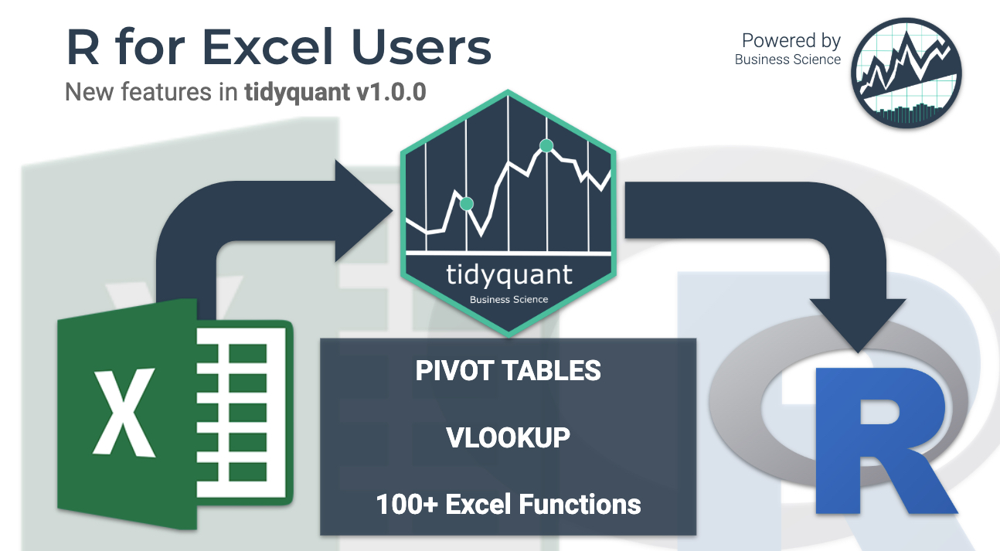

```{r, include = FALSE}
knitr::opts_chunk$set(
  collapse = TRUE,
  comment = "#>",
  message = FALSE,
  warning = FALSE
)
```


__New business and financial analysts are finding R every day.__ Most of these new userRs (R users) are coming from a non-programming background. They have ample domain experience in functions like finance, marketing, and business, but their tool of choice is Excel (or more recently Tableau & PowerBI).

__Learning R can be a major hurdle.__ You need to learn data structures, algorithms, data science, machine learning, web applications with Shiny and more to be able to accomplish a basic dashboard. This is a BIG ASK for non-coders. This is the problem I aim to begin solving with the upcoming release of tidyquant v1.0.0. [__Read the updated "R for Excel Users" Tutorial on Business Science.__](https://www.business-science.io/finance/2020/02/26/r-for-excel-users.html)

```{r, echo=FALSE, out.width="100%"}

```

<p style="text-align:center;"><a href="https://www.business-science.io/finance/2020/02/26/r-for-excel-users.html"> <strong>R for Excel Users Tutorial</strong></p>


